### # 2022-07-11

#### 深拷贝

```javascript
const copyObject = (obj = {}) => {
  let newObj = null
  if (typeof (obj) === 'object' && obj !== null) {
    newObj = obj instanceof Array ? [] : {}
    // 进入下一层进行递归
    for (let i in obj) newObj[i] = copyObject(obj[i])
  } else {
    newObj = obj
  }
  return newObj
}

// 测试
let obj = {
  id: 1,
  func: () => {
    console.log('func')
  },
  userInfo: {
    name: '浩浩',
    age: 23,
    birthday: '1999-05-29'
  },
  hobby: ['敲代码', '还是敲代码']
}

const newObj = copyObject(obj)

obj.userInfo.name = 'haohao'
obj.hobby[0] = '躺平'

console.log('旧值', obj);
console.log('新值', newObj)
```

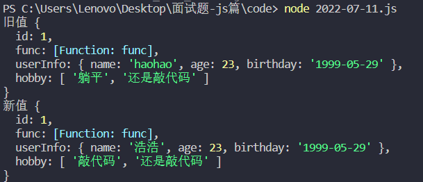

<hr>
### # 2022-07-12

#### 数组去重

```javascript
let arr = [undefined, 2, null, 3, 4, undefined, null, 2, 7, 1, 2, 4, 5]

// 方法一
let a = []
arr.forEach(item => {
  if (!a.includes(item)) a.push(item)
})
console.log("方法一：", a)

// 方法二
let b = Array.from(new Set(arr))
console.log("方法二：", b)
```

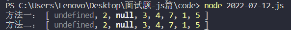

<hr>
### # 2022-07-13

#### 数组扁平化


```javascript
function flatter(arr) {
  if (!arr.length) return;
  
  return arr.reduce((pre, cur) => {
    return Array.isArray(cur) ? [...pre, ...flatter(cur)] : [...pre, cur]
  }, []);
}

// 测试
let arr = [1, 2, [1, [2, 3, [4, 5, [6]]]]]
console.log(flatter(arr));
```

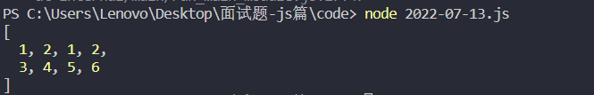

<hr/>

### # 2022-07-14

#### 延迟模拟定时

```javascript
setTimeout (function () {
  eventFunc();
  setTimeout(arguments.callee, 500);
}, 500)

function eventFunc () {
  console.log("每隔0.5秒执行一次");
}
```

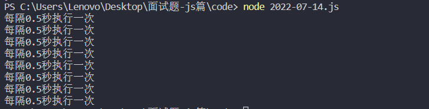

<hr>

### # 2022-07-15

#### 基于 XMLHttpRequest 封装 Ajax

```javascript
let XMLHttpRequest = require('xmlhttprequest').XMLHttpRequest;
function ajax(option) {
    // 请求 url
    let url = option.url;
    // 请求类型
    let type = option.type;
    // 请求参数
    let data = option.data;
    // 是否异步
    let async = option.async === false ? true : option.async;

    // 请求参数处理
    let reqParam = "";
    if (typeof data === "object") {
        for (let key in data) {
            reqParam += `key=${data[key]}&`
        }
        reqParam.slice(0, reqParam.length - 1);
    }

    // 获取 XMLHttpRequest 实例对象
    let xhr = new XMLHttpRequest();

    let flag = false;
    // 监听状态变化
    xhr.onreadystatechange = () => {
        
        // 请求前
        if (xhr.readyState <= 1) {
            
            if (option.beforeSend && !flag) {
                option.beforeSend();
                flag = true;
            }
        }

        // 请求完成
        if (xhr.readyState === 4) {
            let res;
            if (option.complete) option.complete();

            // 响应完成
            if (xhr.status === 200) {

                // 判断响应数据类型
                let resType = xhr.getResponseHeader("content-Type");

                // 响应数据处理
                if (resType.indexOf("json") > -1) {
                    res = JSON.parse(xhr.responseText);
                } else if (resType.indexOf("xml") > -1) {
                    res = xhr.responseXML;
                } else {
                    res = xhr.responseText;
                }

                if (option.success) option.success(res);
            } else {
                if (option.error) option.error(xhr)
            }
        } 
    }

    // get 请求
    if (type === "get" || type === "GET") {
        let fullUrl = reqParam.length == 0 ? url : `${url}?${reqParam}`;
        // 发起请求
        xhr.open(type, fullUrl, async);
        // 发送请求
        xhr.send(null);
    }

    // post 请求
    if (type === "post" || type === "POST") {
        // 发起请求
        xhr.open(type, url, async);
        // 设置请求头
        xhr.setRequestHeader("content-Type", "application/x-www-form-urlencoded");
        // 发送请求
        xhr.send(reqParam);
    }
}

// post
ajax({
    url: "http://39.104.61.32/api/user/register",
    type: "post",
    async: true,
    data: {
        userName: "aaa1231",
        password: "321",
        gender: 2
    },
    beforeSend: function () {
        console.log("api/user/register 请求前");
    },
    success: function (res) {
        console.log("api/user/register 请求成功", res);
    },
    error: function (error) {
        console.log("api/user/register 请求发生错误", error);
    },
    complete: function () {
        console.log("api/user/register 请求完成");
    }
})
// get
ajax({
    url: "http://39.104.61.32/api/atMe/number",
    type: "get",
    async: true,
    beforeSend: function () {
        console.log("api/atMe/number 请求前");
    },
    success: function (res) {
        console.log("api/atMe/number 请求成功", res);
    },
    error: function (error) {
        console.log("api/atMe/number 请求发生错误", error);
    },
    complete: function () {
        console.log("api/atMe/number 请求完成");
    }
})
```

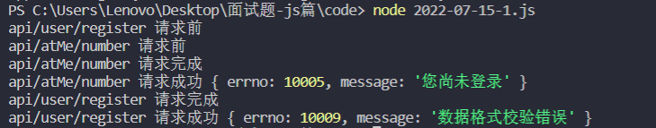

#### 基于 promise 封装 Ajax

```javascript
let XMLHttpRequest = require('xmlhttprequest').XMLHttpRequest;
function http(option) {
    let url = option.url;
    let data = option.url;
    let type = option.type;

    let reqParams = "";
    if (typeof data == "object") {
        for (let key in data) {
            reqParams += `&${key}=${data[key]}`
        }
        reqParams = reqParams.slice(0, str.length - 1);
    }

    return new Promise((resolve, reject) => {
        let xhr = new XMLHttpRequest();
        xhr.onreadystatechange = () => {
            if (xhr.readyState == 4) {
                if (xhr.status == 200) {
                    let res;
                    let resType = xhr.getResponseHeader("content-Type");
                    if (resType.indexOf("jsonp") >= -1) {
                        res = JSON.parse(xhr.responseText);
                    } else if (resType.indexOf("xml") >= -1) {
                        res = xhr.responseXML;
                    } else {
                        res = xhr.responseText;
                    }
                    resolve(res);
                } else {
                    reject(xhr)
                }
            }
        }

        if (type == "get" || type == "GET") {
            let fullUrl = reqParams.length == 0 ? url : `${url}?${reqParams}`;
            xhr.open(type, fullUrl, true);
            xhr.send(null);
        }

        if (type == "post" || type == "POST") {
            xhr.open(type, url, true);
            xhr.setRequestHeader("content-Type", "application/x-www-form-urlencoded");
            xhr.send(reqParams)
        }
    })
}

// get
http({
    url: "http://39.104.61.32/api/atMe/number",
    type: "get"
}).then(res => {
    console.log("api/atMe/number", res)
}).catch(error => {
    console.log(error);
}) 

// post
http({
    url: "http://39.104.61.32/api/blog/create",
    type: "post",
    data: {
        content: "@fwz123123 - fwz123123 123"
    }
}).then(res => {
    console.log("app/user/login", res);
}).catch(error => {
    console.log(error);
})
```

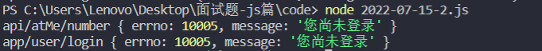

<hr/>

### # 2022-07-16

#### 订阅事件

```html
<!DOCTYPE html>
<html lang="en">
<head>
    <meta charset="UTF-8">
    <meta http-equiv="X-UA-Compatible" content="IE=edge">
    <meta name="viewport" content="width=device-width, initial-scale=1.0">
    <title>$on 和 $emit</title>
</head>
<body>
    <div class="wrapper">
        <div class="container">
            <h3>订阅者</h3>
            <div class="content">
                <div class="a"></div>
                <div class="b"></div>
                <div class="c"></div>
            </div>
            <div class="btn-group publish">
                <button class="btn" data-index="A">订阅事件A</button>
                <button class="btn" data-index="B">订阅事件B</button>
                <button class="btn" data-index="C">订阅事件C</button>
            </div>
            <div class="btn-group cancel-publish">
                <button class="btn" data-index="A">取消事件A</button>
                <button class="btn" data-index="B">取消事件B</button>
                <button class="btn" data-index="C">取消事件C</button>
            </div>
        </div>
        <div class="container">
            <h3>发布者</h3>
            <div class="content">
                <textarea></textarea>
            </div>
            <div class="btn-group send">
                <button class="btn" data-index="A">发布事件A</button>
                <button class="btn" data-index="B">发布事件B</button>
                <button class="btn" data-index="C">发布事件C</button>
            </div>
        </div>
    </div>
</body>
<script src="./js/EventBus.js"></script>
<script>
  let EB = new EventBus();
  let a;
  let b; 
  let c;
  // 订阅事件
  document.querySelector('.publish').addEventListener("click", (e) => {
      if (e.target.tagName == "BUTTON") {
          switch(e.target.dataset.index) {
              case "A":
                  document.querySelector(".container:first-child .content .a").innerHTML = "已经订阅事件A 等待发布者发布事件";
                  a = EB.$on('A', (value) => {
                      document.querySelector(".container:first-child .content .a").innerHTML = "订阅事件A-触发，内容为:"+ value;
                  });
              break;
              case "B":
                  document.querySelector(".container:first-child .content .b").innerHTML = "已经订阅事件B 等待发布者发布事件";
                  b = EB.$on('B', (value) => {
                      document.querySelector(".container:first-child .content .b").innerHTML = "订阅事件B-触发，内容为:"+ value;
                  });
              break;
              case "C":
                  document.querySelector(".container:first-child .content .c").innerHTML = "已经订阅事件C 等待发布者发布事件";
                  c = EB.$on('C', (value) => {
                      document.querySelector(".container:first-child .content .c").innerHTML = "订阅事件C-触发，内容为:"+ value;
                  });
              break;
          }
      }
  });
  // 取消订阅事件
  document.querySelector('.cancel-publish').addEventListener("click", (e) => {
      if (e.target.tagName == "BUTTON") {
          switch(e.target.dataset.index) {
              case "A":
                  EB.$off('A', a);
                  document.querySelector(".container:first-child .content .a").innerHTML = "";
              break;
              case "B":
                  EB.$off('B', b);
                  document.querySelector(".container:first-child .content .b").innerHTML = "";
              break;
              case "C":
                  EB.$off('C', c);
                  document.querySelector(".container:first-child .content .c").innerHTML = "";
              break;
          }
      }
  })

  document.querySelector('.send').addEventListener("click", (e) => {
      if (e.target.tagName == "BUTTON") {
          
          let value = document.querySelector("textarea").value || '默认值'
          let flag;
          switch(e.target.dataset.index) {
              case "A":
                  flag = EB.$emit('A', value);
              break;
              case "B":
                  flag = EB.$emit('B', value);
              break;
              case "C":
                  flag = EB.$emit('C', value);
              break;
          }
          if (flag == -1) alert("订阅者没有订阅事件"+ e.target.dataset.index);
      }
  })
</script>
</html>
```

```javascript
class EventBus {
  constructor() {
      this.callbackId = 0;
      this.eventObj = {}; // 所有订阅事件
  }
  // 订阅事件
  $on(name, callback) {
      if (!this.eventObj[name]) this.eventObj[name] = []
      const id = this.callbackId++;
      this.eventObj[name][id] = callback;
      return id;
  }
  // 取消订阅事件
  $off(name, id) {
      delete this.eventObj[name][id];
      delete this.eventObj[name];
  }
  // 发布事件
  $emit(name, ...args) {
      const eventList = this.eventObj[name];
      if (!eventList) return -1;
      for (const event of eventList) {
          event && event(...args);
      }
      return 1;
  }
}
```

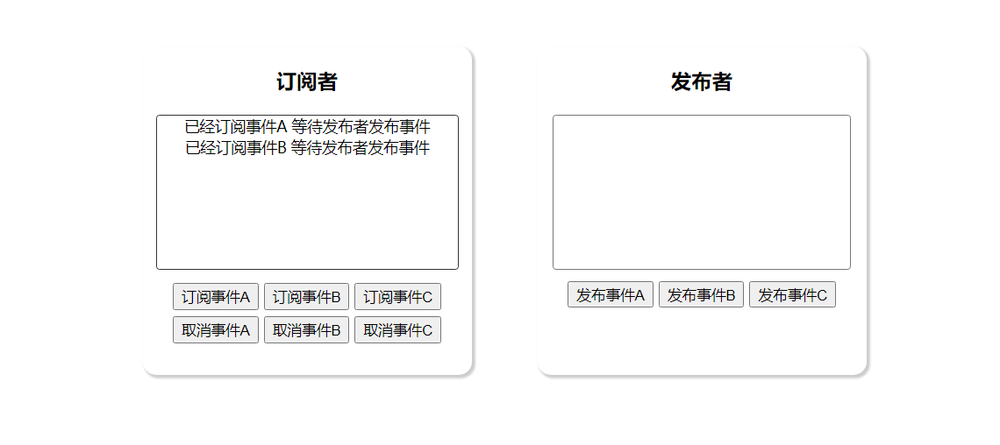

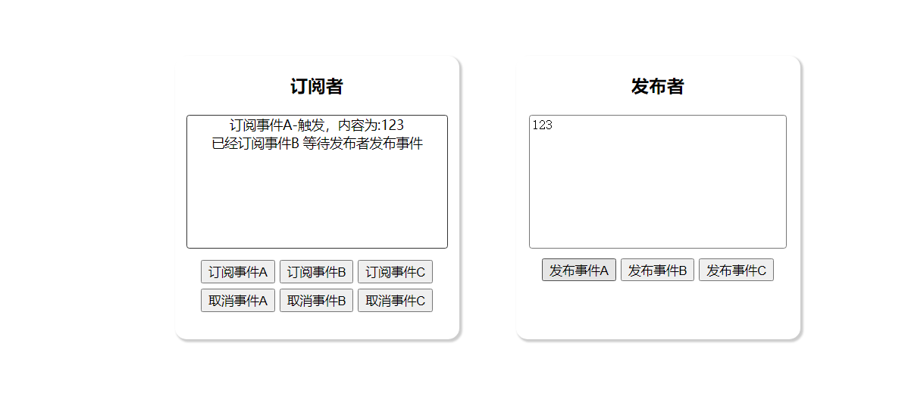

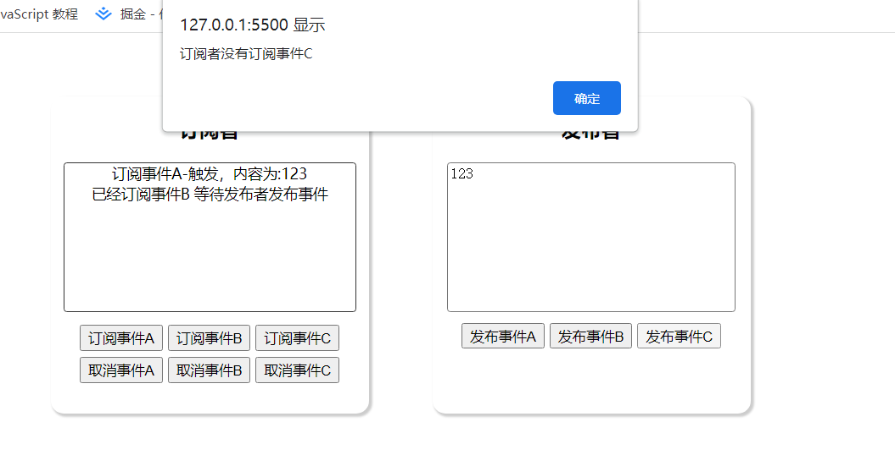

<hr>
### # 2022-07-17

#### 节流函数

```javascript
<!DOCTYPE html>
<html lang="en">
  <head>
    <meta charset="UTF-8" />
    <meta http-equiv="X-UA-Compatible" content="IE=edge" />
    <meta name="viewport" content="width=device-width, initial-scale=1.0" />
    <title>Document</title>
  </head>
  <body>
    <div class="container">1</div>
  </body>
  <script src="./js/Throttle.js"></script>
  <script>
    let event = (e) => {
      let i = e.target.innerHTML - 0;
      e.target.innerHTML = ++e.target.innerHTML;
      // console.log()
    };
    document
      .querySelector(".container")
      .addEventListener(
        "mousemove",
        throttle(event, 2000, { leading: false, trailing: true })
      );
  </script>
</html>
```

```javascript
/**
 * 
 * @param { Function } func 
 * @param { Number } wait 
 * @param {
 *          禁止第一次执行时
 *          leading: false, 
 *          允许最后回调
 *          trailing: true
 *        } options 
 * @returns 
 */
function throttle (func, wait, options) {
  let timeout;
  let context;
  let args;
  // 上一次时间
  let previous = 0;
  if (!options) options = {};
  
  let leading = options.leading;
  let trailing = options.trailing;

  let throttled = function () {

    context = this;
    args = arguments;

    let now = new Date().getTime();
    
    // previous 为 0 （即第一次调用，且 禁止第一次执行时）
    if (!previous && leading === false) previous = now;
    
    // 计算 触发间隔 与 规定间隔时间差值
    let remaining = (wait + previous) - now;

    // 在 previous + wait 这段时间外又再次触发
    if (remaining <= 0) {
      
      // 清除最后回调定时器
      if (timeout) {
        clearTimeout(timeout);
        timeout = null;
      }

      // 更新本次时间
      previous = now;

      // 调用回调函数
      func.apply(context, args);

      // 垃圾回收
      if (!timeout) context = args = null;
      // 在 wait + previous 时间内触发，设置最后的回调函数
    } else if (!timeout && trailing !== false) {
      
      // 再隔 remain (差值) 设置最后一个定时器
      timeout = setTimeout(later, remaining)

      // 垃圾回收
      if (!timeout) context = arg = null;
    }
  };

  let later = function () {
    previous = leading === false ? 0 : new Date();
    timeout = null;
    func.apply(context, args);
  };
  return throttled;
}
```

<figure class="half">
    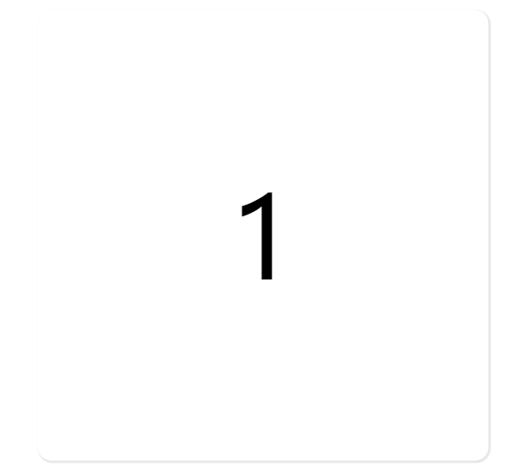
    
</figure>

<hr/>

### # 2022-07-18

#### defineProperty 双向数据绑定

```javascript
// 设置单一属性
function $setKeyResponse(obj, key, area) {
  let renderArea = document.querySelector(area)
  Object.defineProperty(obj, key, {
    get() {
      return this.value;
    },
    set(val) {
      // 视图层更新
      renderArea.innerText = val;

      // 数据层更新
      this.value = val;
    }
  })
}

// 设置所有属性
function $setFullResponse(obj) {
  Object.keys(obj).forEach(key => {
    Object.defineProperty(obj, key, {
      get() {
        return this.value
      },
      set(value) {
        // 根据 key 进行视图更新
        // .......
        // 数据层面更新
        this.value = value;
      }
    })
  })
}
```

注：

（1）只能对对象属性进行劫持，不能对整个对象进行劫持

（2）不能监听到对象属性的增加和删除

（3）数组的 push、pop、shift、unshift、splice、sort，reverse是无法触发 set 方法

> 在 vue 中之所以能够监听数组中 push、pop、shift、unshift、splice、sort，reverse 方法是因为 vue 重写了这些方法

#### Proxy 双向数据绑定

```javascript
function $setKeyResponse(target, key) {
  return new Proxy(target, {
      get(target, prop) {
          return Reflect.get(target, prop)
      },
      set(target, prop, value) {
          // // 单一属性
          // if (Reflect.has(target, key)) {
          //     console.log("更新")
          // }
          Reflect.set(target, prop, value)
      },
      deleteProperty(target, prop) {
          console.log("删除属性", prop)
          Reflect.deleteProperty(target, prop)
          return true
      }
  })
}
```

注：

（1）Proxy 劫持的是对象，因此可以拦截到对象中所有属性的增加删除

（2）proxy 可以且不需要对数组的方法进行重载

```html
<input type="text" />
<button>确定</button>
<div class="area"></div>
 <!-- <script src="./js/defineProperty.js"></script> -->
<script src="./js/proxy.js"></script>
<script>
    let obj = {};
    let inp = document.querySelector("input[type='text']")
    $setKeyResponse(obj, "message", ".area");
    inp.oninput = () => (obj.message = inp.value);
</script>
```

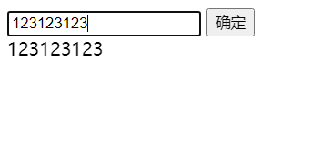

<hr/>

### # 2022-07-19

#### 获取url 请求参数

```javascript
// 2022-07-19-1.js
function getParam(search) {
  let fullUrl = location.search;
  if (fullUrl.indexOf("?") == 0 && fullUrl.indexOf("=") > 1) {
      let obj = {};
      let arrsource = unescape(fullUrl).substring(1, fullUrl.length).split("&");
      arrsource.forEach(item => {
          let arr = item.split("=");
          obj[arr[0]] = arr[1];
      });
      return obj[search];
  }
}
console.log(getParam("classId"));
console.log(getParam("id"));
location.href = "http://127.0.0.1:5500/c.html?classId=123&examId=321"
```

#### 寻找最值

```javascript
function findMax(arr) {
    var len = arr.length;
    var max = arr[0]
    for (var i = 0; i < len; i++) {
        if (arr[i] > max) max = arr[i]
    }
    return max;
}

function findMin(arr) {
    var len = arr.length;
    var min = arr[0]
    for (var i = 0; i < len; i++) {
        if (arr[i] < min) min = arr[i]
    }
    return min;
}

var arr = [1, 2, 4, 3, 8, 3, 2, 6, 9]
console.log("max:", findMax(arr))
console.log("min:", findMin(arr))
```

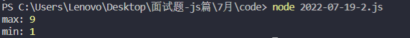

<hr/>

### # 2022-07-20

<hr/>

### # 2022-07-21

<hr/>

### # 2022-07-22

<hr/>

### # 2022-07-23

<hr/>

### # 2022-07-24

<hr/>

### # 2022-07-25

<hr/>

### # 2022-07-26

<hr/>

### # 2022-07-27

<hr/>

### # 2022-07-28

<hr/>

### # 2022-07-29

<hr/>

### # 2022-07-30

<hr/>

### # 2022-07-31

<hr/>
