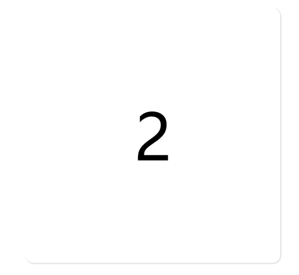
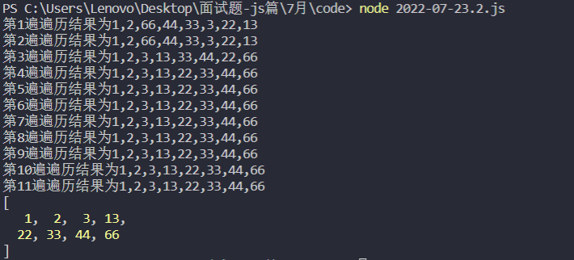
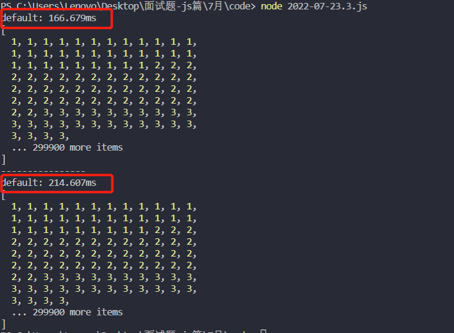

### # 2022-07-11

#### 深拷贝

```javascript
const copyObject = (obj = {}) => {
  let newObj = null
  if (typeof (obj) === 'object' && obj !== null) {
    newObj = obj instanceof Array ? [] : {}
    // 进入下一层进行递归
    for (let i in obj) newObj[i] = copyObject(obj[i])
  } else {
    newObj = obj
  }
  return newObj
}

// 测试
let obj = {
  id: 1,
  func: () => {
    console.log('func')
  },
  userInfo: {
    name: '浩浩',
    age: 23,
    birthday: '1999-05-29'
  },
  hobby: ['敲代码', '还是敲代码']
}

const newObj = copyObject(obj)

obj.userInfo.name = 'haohao'
obj.hobby[0] = '躺平'

console.log('旧值', obj);
console.log('新值', newObj)
```


<hr>

### # 2022-07-12

#### 数组去重

```javascript
let arr = [undefined, 2, null, 3, 4, undefined, null, 2, 7, 1, 2, 4, 5]

// 方法一
let a = []
arr.forEach(item => {
  if (!a.includes(item)) a.push(item)
})
console.log("方法一：", a)

// 方法二
let b = Array.from(new Set(arr))
console.log("方法二：", b)
```


<hr>

### # 2022-07-13


#### 数组扁平化


```javascript
function flatter(arr) {
  if (!arr.length) return;
  
  return arr.reduce((pre, cur) => {
    return Array.isArray(cur) ? [...pre, ...flatter(cur)] : [...pre, cur]
  }, []);
}

// 测试
let arr = [1, 2, [1, [2, 3, [4, 5, [6]]]]]
console.log(flatter(arr));
```


<hr/>

### # 2022-07-14

#### 延迟模拟定时

```javascript
setTimeout (function () {
  eventFunc();
  setTimeout(arguments.callee, 500);
}, 500)

function eventFunc () {
  console.log("每隔0.5秒执行一次");
}
```


<hr>

### # 2022-07-15

#### 基于 XMLHttpRequest 封装 Ajax

```javascript
let XMLHttpRequest = require('xmlhttprequest').XMLHttpRequest;
function ajax(option) {
    // 请求 url
    let url = option.url;
    // 请求类型
    let type = option.type;
    // 请求参数
    let data = option.data;
    // 是否异步
    let async = option.async === false ? true : option.async;

    // 请求参数处理
    let reqParam = "";
    if (typeof data === "object") {
        for (let key in data) {
            reqParam += `key=${data[key]}&`
        }
        reqParam.slice(0, reqParam.length - 1);
    }

    // 获取 XMLHttpRequest 实例对象
    let xhr = new XMLHttpRequest();

    let flag = false;
    // 监听状态变化
    xhr.onreadystatechange = () => {
        
        // 请求前
        if (xhr.readyState <= 1) {
            
            if (option.beforeSend && !flag) {
                option.beforeSend();
                flag = true;
            }
        }

        // 请求完成
        if (xhr.readyState === 4) {
            let res;
            if (option.complete) option.complete();

            // 响应完成
            if (xhr.status === 200) {

                // 判断响应数据类型
                let resType = xhr.getResponseHeader("content-Type");

                // 响应数据处理
                if (resType.indexOf("json") > -1) {
                    res = JSON.parse(xhr.responseText);
                } else if (resType.indexOf("xml") > -1) {
                    res = xhr.responseXML;
                } else {
                    res = xhr.responseText;
                }

                if (option.success) option.success(res);
            } else {
                if (option.error) option.error(xhr)
            }
        } 
    }

    // get 请求
    if (type === "get" || type === "GET") {
        let fullUrl = reqParam.length == 0 ? url : `${url}?${reqParam}`;
        // 发起请求
        xhr.open(type, fullUrl, async);
        // 发送请求
        xhr.send(null);
    }

    // post 请求
    if (type === "post" || type === "POST") {
        // 发起请求
        xhr.open(type, url, async);
        // 设置请求头
        xhr.setRequestHeader("content-Type", "application/x-www-form-urlencoded");
        // 发送请求
        xhr.send(reqParam);
    }
}

// post
ajax({
    url: "http://39.104.61.32/api/user/register",
    type: "post",
    async: true,
    data: {
        userName: "aaa1231",
        password: "321",
        gender: 2
    },
    beforeSend: function () {
        console.log("api/user/register 请求前");
    },
    success: function (res) {
        console.log("api/user/register 请求成功", res);
    },
    error: function (error) {
        console.log("api/user/register 请求发生错误", error);
    },
    complete: function () {
        console.log("api/user/register 请求完成");
    }
})
// get
ajax({
    url: "http://39.104.61.32/api/atMe/number",
    type: "get",
    async: true,
    beforeSend: function () {
        console.log("api/atMe/number 请求前");
    },
    success: function (res) {
        console.log("api/atMe/number 请求成功", res);
    },
    error: function (error) {
        console.log("api/atMe/number 请求发生错误", error);
    },
    complete: function () {
        console.log("api/atMe/number 请求完成");
    }
})
```


#### 基于 promise 封装 Ajax

```javascript
let XMLHttpRequest = require('xmlhttprequest').XMLHttpRequest;
function http(option) {
    let url = option.url;
    let data = option.url;
    let type = option.type;

    let reqParams = "";
    if (typeof data == "object") {
        for (let key in data) {
            reqParams += `&${key}=${data[key]}`
        }
        reqParams = reqParams.slice(0, str.length - 1);
    }

    return new Promise((resolve, reject) => {
        let xhr = new XMLHttpRequest();
        xhr.onreadystatechange = () => {
            if (xhr.readyState == 4) {
                if (xhr.status == 200) {
                    let res;
                    let resType = xhr.getResponseHeader("content-Type");
                    if (resType.indexOf("jsonp") >= -1) {
                        res = JSON.parse(xhr.responseText);
                    } else if (resType.indexOf("xml") >= -1) {
                        res = xhr.responseXML;
                    } else {
                        res = xhr.responseText;
                    }
                    resolve(res);
                } else {
                    reject(xhr)
                }
            }
        }

        if (type == "get" || type == "GET") {
            let fullUrl = reqParams.length == 0 ? url : `${url}?${reqParams}`;
            xhr.open(type, fullUrl, true);
            xhr.send(null);
        }

        if (type == "post" || type == "POST") {
            xhr.open(type, url, true);
            xhr.setRequestHeader("content-Type", "application/x-www-form-urlencoded");
            xhr.send(reqParams)
        }
    })
}

// get
http({
    url: "http://39.104.61.32/api/atMe/number",
    type: "get"
}).then(res => {
    console.log("api/atMe/number", res)
}).catch(error => {
    console.log(error);
}) 

// post
http({
    url: "http://39.104.61.32/api/blog/create",
    type: "post",
    data: {
        content: "@fwz123123 - fwz123123 123"
    }
}).then(res => {
    console.log("app/user/login", res);
}).catch(error => {
    console.log(error);
})
```


<hr/>

### # 2022-07-16

#### 订阅事件

```html
<!DOCTYPE html>
<html lang="en">
<head>
    <meta charset="UTF-8">
    <meta http-equiv="X-UA-Compatible" content="IE=edge">
    <meta name="viewport" content="width=device-width, initial-scale=1.0">
    <title>$on 和 $emit</title>
</head>
<body>
    <div class="wrapper">
        <div class="container">
            <h3>订阅者</h3>
            <div class="content">
                <div class="a"></div>
                <div class="b"></div>
                <div class="c"></div>
            </div>
            <div class="btn-group publish">
                <button class="btn" data-index="A">订阅事件A</button>
                <button class="btn" data-index="B">订阅事件B</button>
                <button class="btn" data-index="C">订阅事件C</button>
            </div>
            <div class="btn-group cancel-publish">
                <button class="btn" data-index="A">取消事件A</button>
                <button class="btn" data-index="B">取消事件B</button>
                <button class="btn" data-index="C">取消事件C</button>
            </div>
        </div>
        <div class="container">
            <h3>发布者</h3>
            <div class="content">
                <textarea></textarea>
            </div>
            <div class="btn-group send">
                <button class="btn" data-index="A">发布事件A</button>
                <button class="btn" data-index="B">发布事件B</button>
                <button class="btn" data-index="C">发布事件C</button>
            </div>
        </div>
    </div>
</body>
<script src="./js/EventBus.js"></script>
<script>
  let EB = new EventBus();
  let a;
  let b; 
  let c;
  // 订阅事件
  document.querySelector('.publish').addEventListener("click", (e) => {
      if (e.target.tagName == "BUTTON") {
          switch(e.target.dataset.index) {
              case "A":
                  document.querySelector(".container:first-child .content .a").innerHTML = "已经订阅事件A 等待发布者发布事件";
                  a = EB.$on('A', (value) => {
                      document.querySelector(".container:first-child .content .a").innerHTML = "订阅事件A-触发，内容为:"+ value;
                  });
              break;
              case "B":
                  document.querySelector(".container:first-child .content .b").innerHTML = "已经订阅事件B 等待发布者发布事件";
                  b = EB.$on('B', (value) => {
                      document.querySelector(".container:first-child .content .b").innerHTML = "订阅事件B-触发，内容为:"+ value;
                  });
              break;
              case "C":
                  document.querySelector(".container:first-child .content .c").innerHTML = "已经订阅事件C 等待发布者发布事件";
                  c = EB.$on('C', (value) => {
                      document.querySelector(".container:first-child .content .c").innerHTML = "订阅事件C-触发，内容为:"+ value;
                  });
              break;
          }
      }
  });
  // 取消订阅事件
  document.querySelector('.cancel-publish').addEventListener("click", (e) => {
      if (e.target.tagName == "BUTTON") {
          switch(e.target.dataset.index) {
              case "A":
                  EB.$off('A', a);
                  document.querySelector(".container:first-child .content .a").innerHTML = "";
              break;
              case "B":
                  EB.$off('B', b);
                  document.querySelector(".container:first-child .content .b").innerHTML = "";
              break;
              case "C":
                  EB.$off('C', c);
                  document.querySelector(".container:first-child .content .c").innerHTML = "";
              break;
          }
      }
  })

  document.querySelector('.send').addEventListener("click", (e) => {
      if (e.target.tagName == "BUTTON") {
          
          let value = document.querySelector("textarea").value || '默认值'
          let flag;
          switch(e.target.dataset.index) {
              case "A":
                  flag = EB.$emit('A', value);
              break;
              case "B":
                  flag = EB.$emit('B', value);
              break;
              case "C":
                  flag = EB.$emit('C', value);
              break;
          }
          if (flag == -1) alert("订阅者没有订阅事件"+ e.target.dataset.index);
      }
  })
</script>
</html>
```

```javascript
class EventBus {
  constructor() {
      this.callbackId = 0;
      this.eventObj = {}; // 所有订阅事件
  }
  // 订阅事件
  $on(name, callback) {
      if (!this.eventObj[name]) this.eventObj[name] = []
      const id = this.callbackId++;
      this.eventObj[name][id] = callback;
      return id;
  }
  // 取消订阅事件
  $off(name, id) {
      delete this.eventObj[name][id];
      delete this.eventObj[name];
  }
  // 发布事件
  $emit(name, ...args) {
      const eventList = this.eventObj[name];
      if (!eventList) return -1;
      for (const event of eventList) {
          event && event(...args);
      }
      return 1;
  }
}
```


<hr>

### # 2022-07-17

#### 节流函数

```javascript
<!DOCTYPE html>
<html lang="en">
  <head>
    <meta charset="UTF-8" />
    <meta http-equiv="X-UA-Compatible" content="IE=edge" />
    <meta name="viewport" content="width=device-width, initial-scale=1.0" />
    <title>Document</title>
  </head>
  <body>
    <div class="container">1</div>
  </body>
  <script src="./js/Throttle.js"></script>
  <script>
    let event = (e) => {
      let i = e.target.innerHTML - 0;
      e.target.innerHTML = ++e.target.innerHTML;
      // console.log()
    };
    document
      .querySelector(".container")
      .addEventListener(
        "mousemove",
        throttle(event, 2000, { leading: false, trailing: true })
      );
  </script>
</html>
```

```javascript
/**
 * 
 * @param { Function } func 
 * @param { Number } wait 
 * @param {
 *          禁止第一次执行时
 *          leading: false, 
 *          允许最后回调
 *          trailing: true
 *        } options 
 * @returns 
 */
function throttle (func, wait, options) {
  let timeout;
  let context;
  let args;
  // 上一次时间
  let previous = 0;
  if (!options) options = {};
  
  let leading = options.leading;
  let trailing = options.trailing;

  let throttled = function () {

    context = this;
    args = arguments;

    let now = new Date().getTime();
    
    // previous 为 0 （即第一次调用，且 禁止第一次执行时）
    if (!previous && leading === false) previous = now;
    
    // 计算 触发间隔 与 规定间隔时间差值
    let remaining = (wait + previous) - now;

    // 在 previous + wait 这段时间外又再次触发
    if (remaining <= 0) {
      
      // 清除最后回调定时器
      if (timeout) {
        clearTimeout(timeout);
        timeout = null;
      }

      // 更新本次时间
      previous = now;

      // 调用回调函数
      func.apply(context, args);

      // 垃圾回收
      if (!timeout) context = args = null;
      // 在 wait + previous 时间内触发，设置最后的回调函数
    } else if (!timeout && trailing !== false) {
      
      // 再隔 remain (差值) 设置最后一个定时器
      timeout = setTimeout(later, remaining)

      // 垃圾回收
      if (!timeout) context = arg = null;
    }
  };

  let later = function () {
    previous = leading === false ? 0 : new Date();
    timeout = null;
    func.apply(context, args);
  };
  return throttled;
}
```

<figure class="half">
    
    
</figure>

<hr/>

### # 2022-07-18

#### defineProperty 双向数据绑定

```javascript
// 设置单一属性
function $setKeyResponse(obj, key, area) {
  let renderArea = document.querySelector(area)
  Object.defineProperty(obj, key, {
    get() {
      return this.value;
    },
    set(val) {
      // 视图层更新
      renderArea.innerText = val;

      // 数据层更新
      this.value = val;
    }
  })
}

// 设置所有属性
function $setFullResponse(obj) {
  Object.keys(obj).forEach(key => {
    Object.defineProperty(obj, key, {
      get() {
        return this.value
      },
      set(value) {
        // 根据 key 进行视图更新
        // .......
        // 数据层面更新
        this.value = value;
      }
    })
  })
}
```

注：

（1）只能对对象属性进行劫持，不能对整个对象进行劫持

（2）不能监听到对象属性的增加和删除

（3）数组的 push、pop、shift、unshift、splice、sort，reverse是无法触发 set 方法

> 在 vue 中之所以能够监听数组中 push、pop、shift、unshift、splice、sort，reverse 方法是因为 vue 重写了这些方法

#### Proxy 双向数据绑定

```javascript
function $setKeyResponse(target, key) {
  return new Proxy(target, {
      get(target, prop) {
          return Reflect.get(target, prop)
      },
      set(target, prop, value) {
          // // 单一属性
          // if (Reflect.has(target, key)) {
          //     console.log("更新")
          // }
          Reflect.set(target, prop, value)
      },
      deleteProperty(target, prop) {
          console.log("删除属性", prop)
          Reflect.deleteProperty(target, prop)
          return true
      }
  })
}
```

注：

（1）Proxy 劫持的是对象，因此可以拦截到对象中所有属性的增加删除

（2）proxy 可以且不需要对数组的方法进行重载

```html
<input type="text" />
<button>确定</button>
<div class="area"></div>
 <!-- <script src="./js/defineProperty.js"></script> -->
<script src="./js/proxy.js"></script>
<script>
    let obj = {};
    let inp = document.querySelector("input[type='text']")
    $setKeyResponse(obj, "message", ".area");
    inp.oninput = () => (obj.message = inp.value);
</script>
```


<hr/>

### # 2022-07-19

#### 获取url 请求参数

```javascript
// 2022-07-19-1.js
function getParam(search) {
  let fullUrl = location.search;
  if (fullUrl.indexOf("?") == 0 && fullUrl.indexOf("=") > 1) {
      let obj = {};
      let arrsource = unescape(fullUrl).substring(1, fullUrl.length).split("&");
      arrsource.forEach(item => {
          let arr = item.split("=");
          obj[arr[0]] = arr[1];
      });
      return obj[search];
  }
}
console.log(getParam("classId"));
console.log(getParam("id"));
location.href = "http://127.0.0.1:5500/c.html?classId=123&examId=321"
```

#### 寻找最值

```javascript
function findMax(arr) {
    var len = arr.length;
    var max = arr[0]
    for (var i = 0; i < len; i++) {
        if (arr[i] > max) max = arr[i]
    }
    return max;
}

function findMin(arr) {
    var len = arr.length;
    var min = arr[0]
    for (var i = 0; i < len; i++) {
        if (arr[i] < min) min = arr[i]
    }
    return min;
}

var arr = [1, 2, 4, 3, 8, 3, 2, 6, 9]
console.log("max:", findMax(arr))
console.log("min:", findMin(arr))
```


<hr/>

### # 2022-07-20

#### 运算符及条件符

```javascript
console.log("---------------------------------------");
// 左移
console.log("2 << 4：", 2 << 4);
// 右移
console.log("32 >> 4：", 32 >> 4);
console.log("---------------------------------------");

// & 与运算符
console.log("3 & 2 与运算符：", 3 & 2);
// 0b011 & 0b010 == 0b010 == 2
// | 或
console.log("3 | 2 与运算符：", 3 | 2);
// 0b011 & 0b010 == 0b011 == 3
console.log("---------------------------------------");

// | & 优先级，从左到右
console.log("0b100 & 0b101 | 0b110:", 0b100 & 0b101 | 0b110)
console.log("---------------------------------------");

// && 
console.log("true && 1：", true && 1);
console.log("false && 1：", false && 1);
console.log("---------------------------------------");

// || 
console.log("true || 1：", true || 1);
console.log("false || 1：", false || 1);
console.log("---------------------------------------");
```


* <<(左移)：一个操作数进行左移运算的时候，结果就是等于操作数乘以2的n次方，n就是左移 的位数
* \>>(右移)：一个操作数在做右移运算的时候，实际上就是等于该操作数除以2的n次方，n就是右移的位数
* & 与运算符：全都为1，与后还是1，其他情况都为 0
* | 或运算符：至少一个为1，或后还是1
* 都存在 & | 时从左到右开始运算
* a && b： a为假时，返回 a，反之为 b
* a || b：a为真时，返回 a，反之为 b
* &、| 优先级高于 &&、||

<hr/>

### # 2022-07-21

#### 虚拟DOM 转 真实 DOM

```javascript
// 真正的渲染函数
function _render(vnode) {
  // 如果是数字类型转化为字符串
  if (typeof vnode === "number") {
    vnode = String(vnode);
  }
  // 字符串类型直接就是文本节点
  if (typeof vnode === "string") {
    return document.createTextNode(vnode);
  }
  // 普通DOM
  const dom = document.createElement(vnode.tag);
  if (vnode.attrs) {
    // 遍历属性
    Object.keys(vnode.attrs).forEach((key) => {
      const value = vnode.attrs[key];
      dom.setAttribute(key, value);
    });
  }
  // 子数组进行递归操作
  vnode.children.forEach((child) => dom.appendChild(_render(child)));
  return dom;
}
```

```html
<!DOCTYPE html>
<html lang="en">
  <head>
    <meta charset="UTF-8" />
    <meta http-equiv="X-UA-Compatible" content="IE=edge" />
    <meta name="viewport" content="width=device-width, initial-scale=1.0" />
    <title>Document</title>
  </head>
  <body>
    <script src="./js/render.js"></script>
    <script>
      let dom = {
        tag: "DIV",
        attrs: {
          id: "app",
        },
        children: [
          {
            tag: "SPAN",
            children: [{ tag: "A", children: [] }],
          },
          {
            tag: "SPAN",
            children: [
              { tag: "A", children: [] },
              { tag: "A", children: [] },
            ],
          },
        ],
      };
      console.log(_render(dom))
    </script>
  </body>
</html>
```

<hr/>

### # 2022-07-22

#### 冒泡排序

基本思想：**循环遍历，每次从前往后把大元素往后调**

```javascript
function BubbleSort (arr) {
  var len = arr.length;
  var temp;
  for (var i = 0; i < len; i++) {
      for (var j = 0; j < len - 1; j++) {
          if (arr[i] < arr[j]) {
              temp = arr[i];
              arr[i] = arr[j];
              arr[j] = temp;
          }
      }
  }
}

let arr = [];
for (let i = 0; i < 1000; i++) {
  let num = Math.floor(Math.random()* (1000 - 1)) + 1;
  arr.push(num);
}

console.time()
BubbleSort(arr);
console.timeEnd();
console.log(arr);
```


【算法分析】

时间复杂度 O(n^2)

空间复杂度O(1)

【特点】

* 稳定排序
* 可用于链式存储结构
* 移动记录次数较多，算法平均时间比直接插入排序差，当初始记录无序，n较大时，此算法不宜采用

补充：可提前结束

```javascript
function BubbleSort(arr) {
    let len = arr.length;
    let flag = 1;
    while (len > 0 && flag == 1) {
        flag = 0;
        for (let j = 1; j <= m; j++) {
            if (arr[j] > arr[j+1]) {
                flag = 1;
                let temp = arr[j];
                arr[j] = arr[j+1];
                arr[j+1] = temp;
            }
        }
    }
}
```

<hr/>

### # 2022-07-23

#### 快速排序

基本思想

* 找到数组中最中间的数值，以该数值为基点，大于该值则放在右侧，反之，左侧。
* 然后利用递归的思想再将左序列当成一个完整的序列再进行排序。
* 同样把序列的右侧也当成一个完整的序列进行排序。
* 直到数组长度 <= 1，返回该数组。

方法一：借助俩数组空间

```javascript
let arr = [1, 5, 3, 7, 6, 8, 12, 0];
function quick(arr) {
    let len = arr.length;

    // 长度为 1
    if (len <= 1) return arr;

    // 取中间值
    let contentValue = arr.splice(Math.floor(len / 2), 1)[0];

    // console.log(contentValue) 6
    // console.log(arr) [1, 5, 3, 7, 8, 12, 0]

    let leftArr = [];
    let rightArr = [];
    for (let i = 0; i < len - 1; i++) {
        let item = arr[i];
        item > contentValue ? rightArr.push(item) : leftArr.push(item)
    }

    return quick(leftArr).concat(contentValue, quick(rightArr))
}
console.log(quick(arr));
```


<hr>

方法二：Lomuto partition scheme

思路：在第一方法的基础之上，利用分区的方式，不借助数组空间

```javascript
/**
 * 
 * @param { Array } arr 
 * @param { Number } left // 左数组起始下标 
 * @param { Number } right  // 右数组起始下标
 */
let i = 0;
function quicksort(arr, left, right) {
  let partitonIndex;

  left = typeof left !== 'number' ? 0 : left;
  right = typeof right !== 'number' ? arr.length - 1 : right;

  if (left < right) {
    partitonIndex = partition(arr, left, right);
    // 左侧快排
    quicksort(arr, left, partitonIndex - 1);
    // 右侧快排
    quicksort(arr, partitonIndex + 1, right);
  }
  console.log(`第${++i}遍遍历结果为${arr.toString()}`);
  return arr;
}
// 分区
function partition(arr, left, right) {
  // 基准点下标
  let pivot = left;
  // 数组第二位开始比较
  let index = pivot + 1;
  for (let i = index; i <= right; i++) {
    // 小于基准点值
    if (arr[i] < arr[pivot]) {
      swap(arr, i, index);
      index++;
    }
  }
  swap(arr, pivot, index - 1);
  return index - 1;
}
// 值交换
function swap(arr, i, j) {
  let temp = arr[i];
  arr[i] = arr[j];
  arr[j] = temp;
}
let arr = [1, 2, 66, 44, 33, 3, 22, 13]
quicksort(arr)
console.log(arr)
```



每次排序取最左边的值为基准值，每次排序结束后，基准值的左侧一定小于基准值。

<hr>

方法三：Hoare partition scheme

思路：以**挖萝卜填坑**为例子实现该算法

规则：

- 首先，一连串待排序的数值指的是该排萝卜的大小。

- **两个工人A、B分别站在并排萝卜的最左侧和最右侧**。

- 确定填坑的判断依据

  - 以挖出**最左边的萝卜**为基准值。
  - **A 为 B 填坑的标准是 挖到的萝卜必须比基准值大，才可为 B 填坑**。
  - B 为 A 填坑，则比基准值小。

- 两工人挖萝卜的方向，及其萝卜是否符合规则。

  - **A ：从左到右，并且该萝卜必须在 B 的左侧**。
  - **B：从右到左，并且该萝卜必须在 A 的右侧**。

- 谁先开始：

  * 一方坑为空时，另外一方先开始为其填坑。

  - 根据前面几点要求，此时 A 所站位置为坑，B为其填坑。

- 什么时候结束：

  俩个工人相遇，则结束该次填坑。

  - 并且相遇位置必定为坑。
  - 把一开始挖出来的萝卜给填到该坑上。可以看到以该位置为基准，左侧都小于该值，右侧都大于该值。
  - 到这里，需要以相遇位置，将其分割成左侧和右侧萝卜，再分别完成两侧的萝卜游戏。
  - 已此类推，直到开始填坑前判断起始位大于等于结束位，则说明萝卜已排好序。

游戏开始：

```java
function quicksort(arr, left, right) {
    let len = arr.length;

    // 起始位
    left = typeof left !== 'number' ? 0 : left;
    // 结束位
    right = typeof right !== 'number' ? len - 1 : right; 
    
    // 两者相遇
    if (left >= right) return

    // 挖出最左边萝卜
    let value = arr[left] 

    // 工人 A 所站位置
    let A = left;
    // 工人 B 所站位置
    let B = right;

    // 两人没有相遇
    while (A < B) {
       // 此时 工人 A 位置是一个空坑

       // B从右往左找比 最左边（value）小的萝卜，并且其位置正在工人 A 的右侧
       while (B > A && arr[B] >= value) {
           B--;
       }
       // B 找到啦，把该位置的萝卜挖个 工人 A 进行填坑
       arr[A] = arr[B];
       // 此时 工人 B 位置是一个空坑

       // A从左往右找比 最左边（value）大的萝卜，并且其位置正在工人 B 的左侧
       while (A < B && arr[A] <= value) {
           A++;
       }
       // A 找到啦 该位置的萝卜挖个 工人 B 进行填坑
       arr[B] = arr[A];
       // 此时 工人 A 位置是一个空坑

       // 如果俩工人没有相遇，则再次为对方填坑
    }
    /*
      该次填坑结束，此时 工人A、工人B（A == B）相遇，并且该位置为空，将一开始挖出来的萝卜   （value）放到该位置上
      
      此时形成的结果是：相遇位置的左侧都小于 value,右侧都大于 value
    */
    arr[A] = value; 

    // 在相遇位置作为分隔点，将其分割成俩个数组，在进行递归

    // 左侧萝卜
    quicksort(arr, left, A);
    // 右侧萝卜
    quicksort(arr, A + 1, right);
}
let arr1 = [];
let arr2 = [];

for (let i = 0; i < 300000; i++) {
    let num = Math.floor(Math.random() * (10000 - 1) + 1);
    arr1.push(num)
    arr2.push(num)
}
console.time()
quicksort(arr1)
console.timeEnd()
console.log(arr1)

console.log("----------------")

console.time()
arr2.sort((a, b) => a - b)
console.timeEnd()
console.log(arr2)
```



<hr>

三种方法总结

- 三种方法都是**不稳定排序**，但与冒泡排序相比较最大的特点是快，并且**当数量较大时，在平均情况下快速排序是所有排序方法中最快的一种**
- 时间复杂度
  - 最坏：O(n^2) 指的是序列已经排好序
  - 最好：O(nlogn)
  - 平均：O(nlogn)
- 除了方法一外，其他两种方法属于**原地排序**。
- 方法一：以牺牲空间，换取时间上的优势。
- 方法二和三：则没有借助其他存储空间的基础上实现了该算法，并且两者都要优于方法一。
- 性能方面：**方法一 < 方法二 < 方法三**。

<hr/>

### # 2022-07-24

#### 直接插入排序

思想：

* 从序列第一个元素开始，该元素可以认为已经被排序。

* 取出下一个元素，设为待插入元素，在已经排序的元素序列中从后向前扫描，如果该元素（已排序）大于待插入元素，将该元素移到下一位置。

* 重复步骤2，直到找到已排序的元素小于或者等于待排序元素的位置，插入元素。

* 重复2，3步骤，完成排序。


```javascript
let instertSort = arr => {
    let temp = 0;
    for (let i = 1; i < arr.length; i++) {
        temp = arr[i];

        for (let j = i - 1; j >= 0; j--) {
            if (temp < arr[j]) {
                arr[j + 1] = arr[j];
                arr[j] = temp;
            } else {
                break
            }
        }
    }
}

let arr = [10, 2, 11, 3, 5, 4, 11, 23, 12, 10]
instertSort(arr);
console.log(arr);
```


【算法分析】

* 时间复杂度 O(n^2) 
* 空间复杂度是O(1)

【算法特点】

* 稳定排序
* 适用于链表结构，在单链表结构上无需移动记录，只需修改相应的指针
* 更适合于初始记录基本有序（正序）的情况，当初始化记录无序，n较大时，此算法时间复杂度较高，不宜采用。

<hr/>

#### 希尔排序

思想：先将整个待排序的记录序列分割成为若干子序列分别进行直接插入排序，待整个序列中的记录“基本有序”时，再对全体记录进行依次直接插入排序


```javascript
let shellSort = arr => {
    let len = arr.length;
    let temp;
    // 间隔
    let gap = 1;

    // 动态定义间隔序列 
    while (gap < len / 3) {
       gap = gap * 3 + 1;
    }

    for (gap; gap > 0; gap = Math.floor(gap / 3)) {
       
        for (let i = gap; i < len; i++) {
            
            
            temp = arr[i];
            
            let j = i - gap;
           

            for(; j >= 0 &&  temp < arr[j]; j -= gap) {
                arr[j + gap] = arr[j];
            }

            arr[j + gap] = temp;
        }
    }

}
let arr = [10, 2, 11, 3, 5, 4, 14, 22, 19, 18, 25, 23, 12, 16, 15]
shellSort(arr)
console.log(arr)
```

【算法分析】

* 不稳定 原地排序
* 最佳情况：T(n) = O(n logn)。 最差情况：T(n) = O(n (log(n))2)。 平均情况：T(n) = 取决于间隙序列
* 空间复杂度： O(1)

【算法特点】

* 记录跳跃式地移动导致排序方法不是很稳定
* 只能用于顺序结构，不能用于链式结构
* 记录总的比较次数和移动次数都比直接插入排序要少，n越大时，效果越明显

<hr/>

### # 2022-07-25

#### 简单选择排序

思路：每次从待排序中的序列中找到一个最小值，并将该值从左往右依次插入到序列中


```javascript
// 简单选择排序
let simpleSelectSort = arr => {
  let len = arr.length;
  for (i = 0; i < len - 1; i++) {
    // 每次已第一个为最小值
    let min = i;

    // 从第 i + 1 开始找最小值
    for (let j = i + 1; j < len; j++) {
       if (arr[j] < arr[min]) min = j;
    }

    // 找到最小值
    if (min != i) {
       let temp = arr[i];
       arr[i] = arr[min];
       arr[min] = temp;
    }
    console.log(`第${i}次排序 ${arr.toString()}`);
  }
}
let arr = [10, 2, 11, 3, 5, 4, 11, 23, 12, 10]
simpleSelectSort(arr);
console.log(arr)
```


【算法分析】

* 简单排序过程中，所需进行记录移动的次数较少。最好情况（正序）：不移动；最坏情况（逆序）：移动3(n-1)次
* 不管什么情况，时间复杂度都为 O(n^2)
* 空间复杂度：O(1)

【算法特点】

* 稳定排序
* 可以用于链表存储结构

<hr/>

### # 2022-07-26

#### 堆排序

```javascript
const heapSort = array => {
    // 初始化大顶堆
    for (let i = Math.floor(array.length / 2 - 1); i >= 0; i--) {
        heapify(array, i, array.length)
    }

    // 排序，每一次 for 循环找出一个当前最大值，数组长度减一
    for (let i = Math.floor(array.length - 1); i > 0; i--) {
        swap(array, 0, i);
        heapify(array, 0, i);
    }

    return array;
}

function swap (array, i, j) {
  let temp = array[i];
  array[i] = array[j];
  array[j] = temp;
}

function heapify(array, i , length) {
   // 当前父节点
   let temp = array[i];
   // j < length 的目的是堆结点 i 以下的结点全部做顺序调整
   for (let j = 2 * i + 1; j < length; j = 2 * j + 1) {
      // 将 array[i] 取出，整个过程相当于找到array[i]应处于的位置
      if (j + 1 < length && array[j] < array[j + 1]) {
        // 找到 两个孩子中较大的一个，再与父结点比较
        j++; 
      }
      if (temp < array[j]) {
        swap(array, i, j);
        i = j; // 交换后， temp 的下标变为j
      } else {
        break;
      }
   }
}
const array = [4, 6, 8, 5, 9, 1, 2, 5, 3, 2];
const newArr = heapSort(array);
console.log(newArr);
```


<hr/>

### # 2022-07-27

#### 归并排序

```javascript
let mergeSort = arr => {
    let len = arr.length;
    
    if (len < 2) return arr;

    let middle = Math.floor(len / 2);
    
    let left = arr.slice(0, middle);
    let right = arr.slice(middle);

    return merge(mergeSort(left), mergeSort(right))
}

let merge = (left, right) => {
    let result = [];

    while (left.length && right.length) {
        if (left[0] <= right [0]) {
            result.push(left.shift())
        } else {
            result.push(right.shift())
        }
    }
    while(left.length) result.push(left.shift());
    while(right.length) result.push(right.shift());
  
    return result;
}
// 测试
const arr = [3, 44, 38, 5, 47, 15, 36, 26, 27, 2, 46, 4, 19, 50, 48];
console.time('归并排序耗时');
console.log('arr :', mergeSort(arr));
console.timeEnd('归并排序耗时');
```


<hr/>

### # 2022-07-28

####  Array.prototype.filter()

```javascript
Array.prototype._filter = function(callback, thisArg) {
  if (this == undefined) throw new TypeError('this is null or not undefined');
  if (typeof callback !== 'function') throw new TypeError(callback + 'is not a function');
  
  const filterArr = [];
  const array = Object(this);
  // 保证len为正整数
  const len = O.length >>> 0;
    
  for (let i = 0; i < len; i++) {
    // 检查i是否在 array 的属性（会检查原型链）
    if (i in array) {
      // 回调函数调用传参
      if (callback.call(thisArg, O[i], i, array)) {
        filterArr.push(O[i]);
      }
    }
  }
  return filterArr;
}
let arr = [1, 4, 4, 5, 2, 6, 10, 5, 6, 4, 6]
arr._filter((item, i) => item > 4)
console.log(arr)
```


#### Array.prototype.map()

```javascript
Array.prototype._map = function(callback, thisArg) {
  if (this == undefined) throw new TypeError('this is null or not defined');
  if (typeof callback !== 'function') throw new TypeError(callback + ' is not a function');
  
  const res = [];
 
  const array = Object(this);
  // 保证len为正整数
  const len = array.length >>> 0;

  for (let i = 0; i < len; i++) {
    if (i in array) {
      // 调用回调函数并传入新数组
      res[i] = callback.call(thisArg, array[i], i, this);
    }
  }
  return res;
}
let arr = [1, 4, 4, 5, 2, 6, 10, 5, 6, 4, 6]
let mapArr = arr._map((item, i) => item * 2)
console.log(mapArr)
```


<hr/>

### # 2022-07-29

#### Array.prototype._forEach()

```javascript
Array.prototype._forEach = function(callback, thisArg) {
  if (this == null) throw new TypeError('this is null or not defined');
  if (typeof callback !== "function")  throw new TypeError(callback + ' is not a function');
  
  const arr = Object(this);
  const len = arr.length >>> 0;
  for (let i = 0; i < len; i++) {
    callback.call(thisArg, arr[i], i, arr);
  }  
}

let arr = [
  {
    name: "小明",
    age: 12
  },
  {
    name: "小红",
    age: 12
  }
]
arr._forEach(item => {
  console.log(`${item.name} - ${item.age}`)
})
```


<hr/>

### # 2022-07-30

### **Array**.**prototype**.reduce()

```javascript
Array.prototype.reduce = function(callback, initialValue) {
  if (this == undefined) throw new TypeError('this is null or not defined');
  if (typeof callback !== 'function') throw new TypeError(callbackfn + ' is not a function');
  
  const arr = Object(this);
  const len = arr.length >>> 0;
  
  let accumulator = initialValue;
  let k = 0;
  // 如果第二个参数为undefined的情况下
  // 则数组的第一个有效值作为累加器的初始值
  if (accumulator === undefined) {
    while (k < len && !(k in O)) {
      k++;
    }
    // 如果超出数组界限还没有找到累加器的初始值，则TypeError
    if (k >= len) {
      throw new TypeError('Reduce of empty array with no initial value');
    }
    accumulator = O[k++];
  }
  while (k < len) {
    if (k in O) {
      accumulator = callback.call(undefined, accumulator, O[k], k, O);
    }
    k++;
  }
  return accumulator;
}
```

<hr/>

### # 2022-07-31

#### 并发数控制

```javascript
class Scheduler {
  constructor() {
    this.queue = [];
    this.maxCount = 2;
    this.runCounts = 0;
  }
  add(promiseCreator) {
    this.queue.push(promiseCreator);
  }
  taskStart() {
    for (let i = 0; i < this.maxCount; i++) {
      this.request();
    }
  }
  request() {
    if (!this.queue || !this.queue.length || this.runCounts >= this.maxCount) {
      return;
    }
    this.runCounts++;

    this.queue.shift()().then(() => {
      this.runCounts--;
      this.request();
    });
  }
}
   
const timeout = time => new Promise(resolve => {
  setTimeout(resolve, time);
})
  
const scheduler = new Scheduler();
  
const addTask = (time,order) => {
  scheduler.add(() => timeout(time).then(()=>console.log(order)))
}
  
  
addTask(1000, '1');
addTask(500, '2');
addTask(300, '3');
addTask(400, '4');
scheduler.taskStart()
// 2
// 3
// 1
// 4
```
