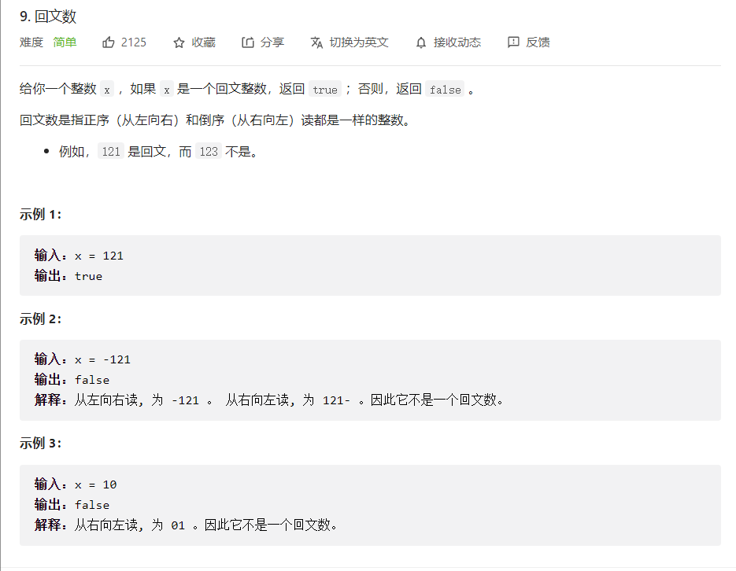
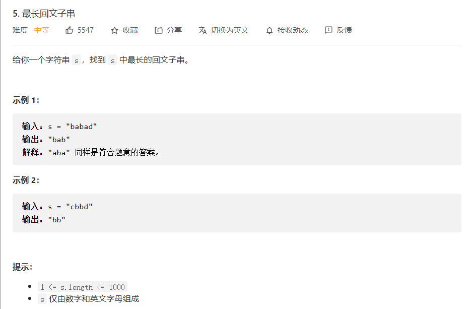
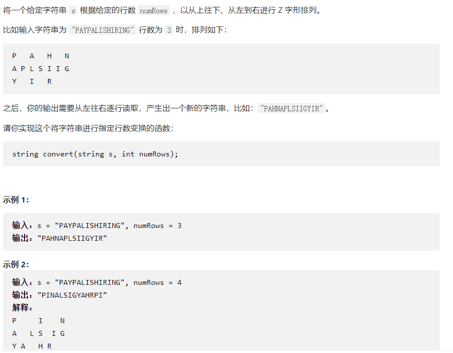
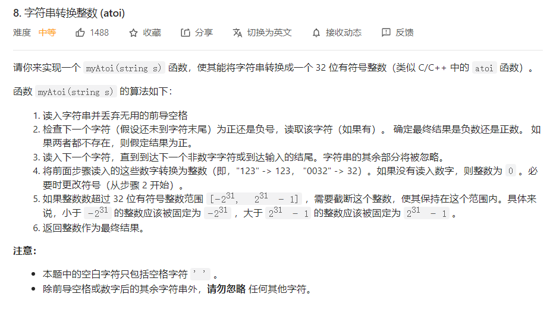
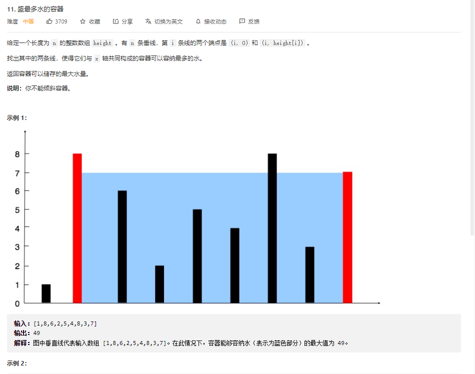
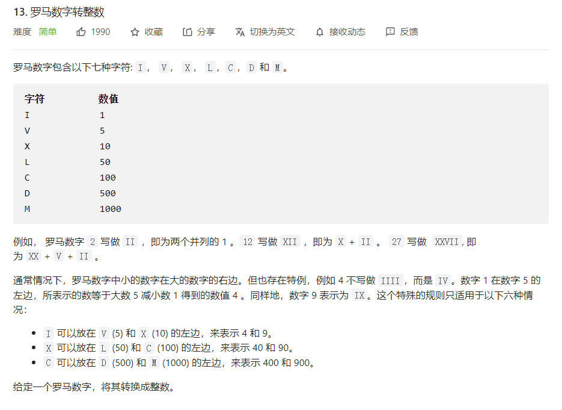
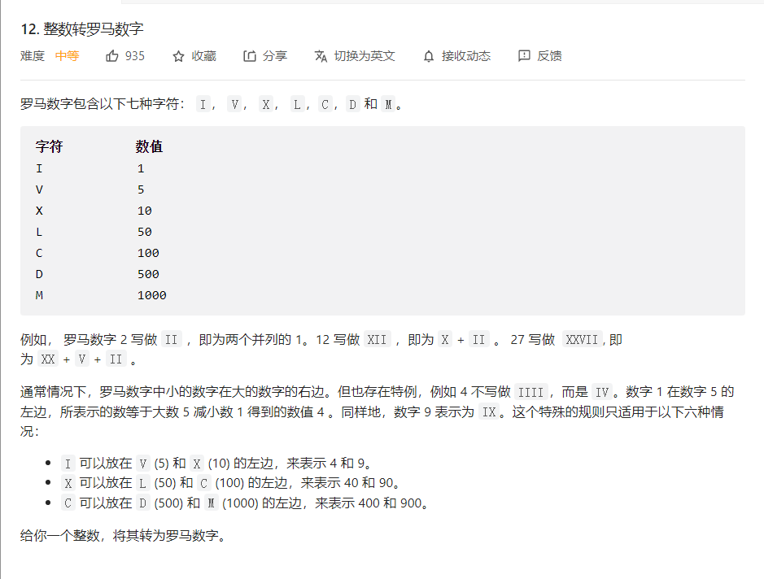

###  2022-08-01

#### 低配版 promise

```javascript
class MyPromise {
  constructor(executor) {
    // 成功回调队列
    this._resolveQueue = [];
    // 失败回调队列
    this._rejectQueue = [];

    let resolve = (val) => {
      while (this._resolveQueue.length) {
        const callback = this._resolveQueue.shift();
        callback(val);
      }
    }

    let reject = (val) => {
      while (this._rejectQueue.length) {
        const callback = this._rejectQueue.shift();
        callback(val);
      }
    }

    // 创建实例对象时，立即执行 executor 并传入 resolve 和 reject
    executor(resolve, reject);
  }

  then = (resolveFunc, rejectFunc) => {
    this._resolveQueue.push(resolveFunc);
    this._rejectQueue.push(rejectFunc);
  }
}

// 测试
const p = new MyPromise((resolve, reject) => {
  setTimeout(() => {
    resolve('result');
  }, 2000);
});

p.then(res => console.log(res)); // result
```

- Promise 构造方法接收一个` executor()`，在 `new Promise()` 时立即执行该任务。
- `executor()` 内部的异步任务会被放入到 宏/微任务队列，等待执行。
- `then()`被执行，收集成功/失败回调，放入成功/失败队列。
- `executor()`的异步任务被执行，触发`resolve/reject`，从成功/失败队列中取出回调依次执行。

<hr>

###  2022-08-02

#### Promise A+规范 + then 链式调用

```javascript
const PENDING = "pending";
const FULFILLED = "fulfilled";
const REJECTED = "rejected";

class MyPromise {
  constructor(executor) {
    this.status = PENDING;
    this.resolveQueue = [];
    this.rejectQueue = [];
    let resolve = (val) => {
      if (this.status !== PENDING) return;

      this.status = FULFILLED;

      while (this.resolveQueue.length) {
        let callback = this.resolveQueue.shift();
        callback(val);
      }
    }

    let reject = (val) => {
      if (this.status !== PENDING) return;

      this.status = REJECTED;

      while (this.rejectQueue.length) {
        let callback = this.rejectQueue.shift();
        callback(val);
      }
    }
    executor(resolve, reject);
  }
  then = (resolveFunc, rejectFunc) => {
    return new MyPromise((resolve, reject) => {
      let successFunc = (val) => {
        try {
          let x = resolveFunc(val);
          x instanceof MyPromise ? x.then(resolve, reject) : resolve(x);
        } catch (error) {
          reject(error);
        }
      }
      this.resolveQueue.push(successFunc);

      let errorFunc = (error) => {
        try {
          let x = rejectFunc(error);
          x instanceof MyPromise ? x.then(resolve, reject) : reject(x);
        } catch (error) {
          reject(error);
        }
      }
      this.rejectQueue.push(errorFunc);
    })
  }
}
// 测试
const p1 = new MyPromise((resolve, reject) => {
  setTimeout(() => {
    resolve(1)
  }, 500);
})

p1.then(res => {
  console.log(res)
  return 2
}).then(res => {
    console.log(res)
    return 3
}).then(res => {
    console.log(res)
})
//输出 1 2 3
```

<hr>

### 2022-08-03

#### 值穿透、状态变更

```javascript
// 暂停
const PENDING = 'pending'
// 完成
const FULFILLED = 'fulfilled'
// 拒绝
const REJECTED = 'rejected'
class Mypromise {
    constructor(executor) {
        this.status = PENDING;
        this.preValue = null;
        this.resolveQueue = [];
        this.rejectQueue = [];
        let resolve = (val) => {
            if (this.status !== PENDING) return;
            this.status = FULFILLED;

            this.preValue = val;

            while (this.resolveQueue.length) {
                let callback = this.resolveQueue.shift();
                callback(val);
            }
        }

        let reject = (val) => {
            if (this.status !== PENDING) return;
            this.status = REJECTED;

            this.preValue = val;

            while (this.rejectQueue.length) {
                let callback = this.rejectQueue.shift();
                callback(val);
            }
        }
        executor(resolve, reject);
    }
    then = (resolveFunc, rejectFunc) => {
        return new MyPromise((resolve, reject) => {

            typeof resolveFunc !== 'function' ? resolveFunc = value => value : null;
            typeof rejectFunc !== 'function' ? rejectFunc = reason => {
                throw new Error(reason instanceof Error ? reason.message : reason)
                } : null;

            let successFunc = (val) => {
                try {
                    let x = resolveFunc(val);
                    x instanceof MyPromise ? x.then(resolve, reject) : resolve(x);
                } catch (error) {
                    reject(error);
                }
            }
            let errorFunc = (error) => {
                try {
                    let x = rejectFunc(error);
                    x instanceof MyPromise ? x.then(resolve, reject) : reject(x);
                } catch (error) {
                    reject(error);
                }
            }

            switch (this.status) {
                case PENDING:
                    this.resolveQueue.push(successFunc);
                    this.rejectQueue.push(errorFunc);
                    break;
                case FULFILLED:
                    resolveFunc(this.preValue);
                    break;
                case REJECTED:
                    rejectFunc(this.preValue);
                    break;
            }
        })
    }
}
```

<hr>

### 2022-08-04

#### 兼容同步任务

```javascript
const PENDING = "pending";
const FULFILLED = "fulfilled";
const REJECTED = "rejected";
class MyPromise {
    constructor(executor) {
        this.status = PENDING;
        this.preval = null;
        this.resolveQueue = [];
        this.rejectQueue = [];

        let resolve = (val) => {
           const run = () => {
               if (this.status !== PENDING) return;

               this.status = FULFILLED;
               this.preval = val;

               while (this.resolveQueue.length) {
                   let callback = this.resolveQueue.shift();
                   callback(val);
               }
           }
           setTimeout(run)
        }
        let reject = (val) => {
            const run = () => {
                if (this.status !== PENDING) return;

                this.status = REJECTED;
                this.preval = val;

                while (this.rejectQueue.length) {
                    let callback = this.rejectQueue.shift();
                    callback(val);
                } 
            }
            setTimeout(run)
        }

        executor(resolve, reject);
    }
    then = (resolveFunc, rejectFunc) => {
        return new MyPromise((resolve, reject) => {

            typeof resolveFunc !== 'function' ? resolveFunc = val => val : null;
            typeof rejectFunc !== 'function' ? rejectFunc = reason => {
                throw new Error(reason instanceof Error ? reason.message : reason)
            } : null;

            let successFunc = (val) => {
                try {
                    let x = resolveFunc(val);
                    x instanceof MyPromise ? x.then(resolve, reject) : resolve(x)
                } catch (error) {
                    reject(error);
                }
            }

            let errorFunc = (val) => {
                try {
                    let x = rejectFunc(val);
                    x instanceof MyPromise ? x.then(resolve, reject) : reject(x);
                } catch (error) {
                  reject(error);
                }
            }

            switch (this.status) {
                case PENDING:
                    this.resolveQueue.push(successFunc);
                    this.rejectQueue.push(errorFunc);
                    break;
                case FULFILLED:
                    resolveFunc(this.preval);
                    break;
                case REJECTED:
                    rejectFunc(this.preval);
                    break;
            }
        })
    }
}
```

<hr>

### 2022-08-05


#### promise其他方法

```javascript
const PENDING = 'pending';
const FULFILLED = 'fulfilled';
const REJECTED = 'rejected';

class MyPromise {
    constructor(executor) {
        this.status = PENDING;
        this.val = null;
        this.resolveQueue = [];
        this.rejectQueue = [];

        let resolve = (val) => {
            const run = () => {
                if (this.status !== PENDING) return;

                this.status = FULFILLED;
                this.val = val;

                while (this.resolveQueue.length) {
                    let callback = this.resolveQueue.shift();
                    callback(val);
                }
            }
            setTimeout(run);
        }

        let reject = (val) => {
           const  run = () => {
               if (this.status !== PENDING) return;

               this.status = REJECTED;
               this.val = val;

               while (this.rejectQueue.length) {
                   let callback = this.rejectQueue.shift();
                   callback(val);
               }
           }
           setTimeout(run);
        }
        executor(resolve, reject)
    }
    then = (resolveFunc, rejectFunc) => {
        return new MyPromise((resolve, reject) => {
            typeof resolveFunc !== 'function' ? resolveFunc = val => val : null;
            typeof rejectFunc !== 'function' ? rejectFunc = reason => {
                throw new Error(reason instanceof Error ? reason.message : reason);
            } : null;

            let successFunc = (val) => {
                try {
                    let x = resolveFunc(val);
                    x instanceof MyPromise ? x.then(resolve, reject) : resolve(x)
                } catch (e) {
                    reject(e);
                }
            }
            let errorFunc = (val) => {
                try {
                    let x = rejectFunc(val);
                    x instanceof MyPromise ? x.then(resolve, reject) : reject(x)
                } catch (e) {
                    reject(e);
                }
            }

            switch (this.status) {
                case PENDING:
                    this.resolveQueue.push(successFunc);
                    this.rejectQueue.push(errorFunc);
                    break;
                case FULFILLED:
                    resolveFunc(this.val);
                    break;
                case REJECTED:
                    rejectFunc(this.val);
                    break;
            }
        })
    }

    static resolve(value) {
        if (value instanceof MyPromise) return value;
        return new MyPromise(resolve => resolve(value))
    }
    static reject(reason) {
        return new MyPromise((resolve, reject) => reject(reason))
    }
    static all() {}
    static race() {}
    // catch方法其实就是执行一下then的第二个回调
    catch(rejectFunc) {
        return this.then(undefined, rejectFunc)
    }
    finally(callback) {
        return this.then(
            value => MyPromise.resolve(callback()).then(() => value),             // MyPromise.resolve执行回调,并在then中return结果传递给后面的Promise
            reason => MyPromise.resolve(callback()).then(() => { throw reason })  // reject同理
        )
    }
}
```

<hr>

### 2022-08-06


#### 判断是否为回文子串

```javascript
function test(str) {
    let len = str.length;
    let l = 0;
    let r = len - 1;
    let flag = true;
    while (l < r && flag) {
        if (str.charAt(l) != str.charAt(r)) flag = false;
        l++;
        r--;
    }
    return flag;
}
```

<hr>

#### 判断是否为回文数




```javascript
function test(num) {
   if (num < 0 || num % 10 == 0) return false;
   let temp = num;
   let reverse = 0;
   while(temp != 0) {
       let x = temp % 10;

       temp = Math.floor(temp / 10);
       reverse = reverse * 10 + x;
   }
   return  reverse == num;
}
console.log(test(32))
```

<hr>

#### 最长回文子串




解法：双指针

回文子串分为两种

- 奇数子串 aba
- 偶数子串 abba

取中心点向俩边扩散

- 奇数中心点 左：i 右：i
- 偶数中心点 左：i 右：i+1

```javascript
let longestPalindrome = function (s) {
    let max = "";
    for (let i = 0; i < s.length; i++) {
        // 奇数子串
        helper(i, i);
        // 偶数子串
        helper(i, i+1);
    }
    function helper(l, r) {
        // 找左右相同字符串
        while (l >= 0 && r < s.length && s[l] == s[r]) {
            l--;
            r++;
        }
        // 找到回文子串后，由于 while 再执行了一轮循环，故需要对指针进行回退，即 (l + 1) (r - 1)
        const maxStr = s.slice(l + 1, r + 1 - 1);
        if (maxStr.length > max.length) max = maxStr;
    }
    return max;
}

let s = "abbaabbaaccaabbaab";
console.log(longestPalindrome(s));
```

<hr>

### 2022-08-07


#### Z字形变换



```javascript
// 0         | 6        12
// 1       5 | 7     11 13
// 2   4     | 8  10
// 3         | 9

let test = (s, row) => {
    if (row <= 1 || row >= s.length) return s;

    // 周期
    let space = 2 * row - 2;
    let result = "";
    for (let i = 0; i < row; i ++) { // 层数循环（纵向）
        for (let j = i; j < s.length; j += space) { // 单层循环 （横向）
            result += s.charAt(j);

            let mod = j % space;
            // 非第一行和最后一行
            if (mod > 0 && i != 0 && i != row - 1) {
                // 在周期范围内，当前位置j 到下一个位置的距离
                // 类似计算 1 =》 5， 7 =》 11 之间的距离
                let index = j + 2 * (row - i - 2);
                result += s.charAt(index);
            }
        }
    }
    return result;
}
let str = 'PAYPALISHIRING';
console.log(test(str, 3)) // PAHN APLSIIG YIR
// P   A   H   N
// A P L S I I G
// Y   I   R
// PAHN APLSIIG YIR

console.log(test(str, 4)) // PIN ALSIG YAHR PI
// P      I       N
// A    L S     I G
// Y  A   H   R
// P      I
// PIN ALSIG YAHR PI
```

<hr/>

### 2022-08-08

####  字符串转换整数



解法：

```javascript
    function test(s) {
        let flag = 1;
        let res = 0;
        let i = 0;
        // 过滤空格
        while (s.charAt(i) === '') i++;

        // 判断正负
        if (i < s.length && s.charAt(i) === '+') {
            i++;
        } else if (x < s.length && s.charAt(i) === '-') {
            i++;
            flag = -1;
        }

        while(i < s.length && s.charAt(i) <= '9' && s.charAt(i) >= '0') {
            let tmp = s.charAt(i) - 0;
            res = res * 10 + tmp;

            if (res <= -2147483648) return -2147483648;
            else if (res >= 2147483647) return 2147483647;
        }
        return res;
    }
```

补充：

```javascript
// 去除字符串内所有的空格：
str = str.replace(/\s*/g,"");
//去除字符串内两头的空格：
str = str.replace(/^\s*|\s*$/g,"");
// 去除字符串内左侧的空格：
str = str.replace(/^\s*/,"");
// 去除字符串内右侧的空格：
str = str.replace(/(\s*$)/g,"");
```

<hr>

####  盛最多水的容器



解法：双指针

* 从两端位置向中间靠拢，计算当前面积。
* 比较当前两端高度值，高度小的一边向中间靠拢。
* 当两端重合时，结束，输出最大面积

```javascript
function test(arr) {
    let l = 0;
    let r = arr.length - 1;
    let max = 0;
    while(l < r) {
        let maxArea = (r - l) * Math.min(arr[l], arr[r]);
        if (maxArea > max) max = maxArea;
        arr[l] < arr[r] ? l++ : r--;
    }
    return max;
}
```

<hr>
### 2022-08-09

#### 罗马数字转整数



解法：

* 根据罗马数字的特点：从左到右，值依次递减。
* 如果当前位置小于下一个值，则要减去该值，反则累加

```javascript
var romanToInt = function(s) {
  let obj = {
      "M": 1000,
      "D": 500,
      "C": 100,
      "L": 50,
      "X": 10,
      "V": 5,
      "I": 1
  }
  let res = 0;
  for (let i = 0; i < s.length-1; i++) {
      if (obj[s.charAt(i)] >= obj[s.charAt(i+1)]) {
          res += obj[s.charAt(i)]
      } else {
          res -= obj[s.charAt(i)]
      }
  }
  return res + obj[s.charAt(s.length-1)];
}
```

<hr>

#### 数字转罗马数字



解法：贪心算法

* 对整数做减法，每次都减去符合罗马数的最大值

```javascript
var intToRoman = function(num) {
    let arr = [
        {
            value: 1000,
            char: "M"
        },{
            value: 900,
            char: "CM"
        },{
            value: 500,
            char: "D"
        },{
            value: 400,
            char: "CD"
        },{
            value: 100,
            char: "C"
        },{
            value: 90,
            char: "XC"
        },{
            value: 50,
            char: "L"
        },{
            value: 40,
            char: "XL"
        },{
            value: 10,
            char: "X"
        },{
            value: 9,
            char: "IX"
        },{
            value: 5,
            char: "V"
        },{
            value: 4,
            char: "IV"
        },{
            value: 1,
            char: "I"
        }
    ];
    let res = "";
    for (let i = 0; i < arr.length && num >= 0; ++i) {
        // 减去最大值
        while (num >= arr[i].value) {
            num -= arr[i].value;
            res += arr[i].char;
        }
    }
    return res;
};
```

<hr>

### 2022-08-10

<hr>

### 2022-08-11

<hr>

### 2022-08-12

<hr>

### 2022-08-13

<hr>

### 2022-08-14

<hr>

### 2022-08-15

<hr>

### 2022-08-16

<hr>

### 2022-08-17

<hr>

### 2022-08-18

<hr>

### 2022-08-19

<hr>

### 2022-08-20

<hr>

### 2022-08-21

<hr>

### 2022-08-22

<hr>

### 2022-08-23

<hr>

### 2022-08-24

<hr>

### 2022-08-25

<hr>

### 2022-08-26

<hr>

### 2022-08-27

<hr>

### 2022-08-28

<hr>

### 2022-08-29

<hr>

### 2022-08-30

<hr>

### 2022-08-31

<hr>