###  2022-08-01

#### 低配版 promise

```javascript
class MyPromise {
  constructor(executor) {
    // 成功回调队列
    this._resolveQueue = [];
    // 失败回调队列
    this._rejectQueue = [];

    let resolve = (val) => {
      while (this._resolveQueue.length) {
        const callback = this._resolveQueue.shift();
        callback(val);
      }
    }

    let reject = (val) => {
      while (this._rejectQueue.length) {
        const callback = this._rejectQueue.shift();
        callback(val);
      }
    }

    // 创建实例对象时，立即执行 executor 并传入 resolve 和 reject
    executor(resolve, reject);
  }

  then = (resolveFunc, rejectFunc) => {
    this._resolveQueue.push(resolveFunc);
    this._rejectQueue.push(rejectFunc);
  }
}

// 测试
const p = new MyPromise((resolve, reject) => {
  setTimeout(() => {
    resolve('result');
  }, 2000);
});

p.then(res => console.log(res)); // result
```

- Promise 构造方法接收一个` executor()`，在 `new Promise()` 时立即执行该任务。
- `executor()` 内部的异步任务会被放入到 宏/微任务队列，等待执行。
- `then()`被执行，收集成功/失败回调，放入成功/失败队列。
- `executor()`的异步任务被执行，触发`resolve/reject`，从成功/失败队列中取出回调依次执行。

<hr>

###  2022-08-02

#### Promise A+规范 + then 链式调用

```javascript
const PENDING = "pending";
const FULFILLED = "fulfilled";
const REJECTED = "rejected";

class MyPromise {
  constructor(executor) {
    this.status = PENDING;
    this.resolveQueue = [];
    this.rejectQueue = [];
    let resolve = (val) => {
      if (this.status !== PENDING) return;

      this.status = FULFILLED;

      while (this.resolveQueue.length) {
        let callback = this.resolveQueue.shift();
        callback(val);
      }
    }

    let reject = (val) => {
      if (this.status !== PENDING) return;

      this.status = REJECTED;

      while (this.rejectQueue.length) {
        let callback = this.rejectQueue.shift();
        callback(val);
      }
    }
    executor(resolve, reject);
  }
  then = (resolveFunc, rejectFunc) => {
    return new MyPromise((resolve, reject) => {
      let successFunc = (val) => {
        try {
          let x = resolveFunc(val);
          x instanceof MyPromise ? x.then(resolve, reject) : resolve(x);
        } catch (error) {
          reject(error);
        }
      }
      this.resolveQueue.push(successFunc);

      let errorFunc = (error) => {
        try {
          let x = rejectFunc(error);
          x instanceof MyPromise ? x.then(resolve, reject) : reject(x);
        } catch (error) {
          reject(error);
        }
      }
      this.rejectQueue.push(errorFunc);
    })
  }
}
// 测试
const p1 = new MyPromise((resolve, reject) => {
  setTimeout(() => {
    resolve(1)
  }, 500);
})

p1.then(res => {
  console.log(res)
  return 2
}).then(res => {
    console.log(res)
    return 3
}).then(res => {
    console.log(res)
})
//输出 1 2 3
```

<hr>

### 2022-08-03

#### 值穿透、状态变更

```javascript
// 暂停
const PENDING = 'pending'
// 完成
const FULFILLED = 'fulfilled'
// 拒绝
const REJECTED = 'rejected'
class Mypromise {
    constructor(executor) {
        this.status = PENDING;
        this.preValue = null;
        this.resolveQueue = [];
        this.rejectQueue = [];
        let resolve = (val) => {
            if (this.status !== PENDING) return;
            this.status = FULFILLED;

            this.preValue = val;

            while (this.resolveQueue.length) {
                let callback = this.resolveQueue.shift();
                callback(val);
            }
        }

        let reject = (val) => {
            if (this.status !== PENDING) return;
            this.status = REJECTED;

            this.preValue = val;

            while (this.rejectQueue.length) {
                let callback = this.rejectQueue.shift();
                callback(val);
            }
        }
        executor(resolve, reject);
    }
    then = (resolveFunc, rejectFunc) => {
        return new MyPromise((resolve, reject) => {

            typeof resolveFunc !== 'function' ? resolveFunc = value => value : null;
            typeof rejectFunc !== 'function' ? rejectFunc = reason => {
                throw new Error(reason instanceof Error ? reason.message : reason)
                } : null;

            let successFunc = (val) => {
                try {
                    let x = resolveFunc(val);
                    x instanceof MyPromise ? x.then(resolve, reject) : resolve(x);
                } catch (error) {
                    reject(error);
                }
            }
            let errorFunc = (error) => {
                try {
                    let x = rejectFunc(error);
                    x instanceof MyPromise ? x.then(resolve, reject) : reject(x);
                } catch (error) {
                    reject(error);
                }
            }

            switch (this.status) {
                case PENDING:
                    this.resolveQueue.push(successFunc);
                    this.rejectQueue.push(errorFunc);
                    break;
                case FULFILLED:
                    resolveFunc(this.preValue);
                    break;
                case REJECTED:
                    rejectFunc(this.preValue);
                    break;
            }
        })
    }
}
```

<hr>

### 2022-08-04

#### 兼容同步任务

```javascript
const PENDING = "pending";
const FULFILLED = "fulfilled";
const REJECTED = "rejected";
class MyPromise {
    constructor(executor) {
        this.status = PENDING;
        this.preval = null;
        this.resolveQueue = [];
        this.rejectQueue = [];

        let resolve = (val) => {
           const run = () => {
               if (this.status !== PENDING) return;

               this.status = FULFILLED;
               this.preval = val;

               while (this.resolveQueue.length) {
                   let callback = this.resolveQueue.shift();
                   callback(val);
               }
           }
           setTimeout(run)
        }
        let reject = (val) => {
            const run = () => {
                if (this.status !== PENDING) return;

                this.status = REJECTED;
                this.preval = val;

                while (this.rejectQueue.length) {
                    let callback = this.rejectQueue.shift();
                    callback(val);
                } 
            }
            setTimeout(run)
        }

        executor(resolve, reject);
    }
    then = (resolveFunc, rejectFunc) => {
        return new MyPromise((resolve, reject) => {

            typeof resolveFunc !== 'function' ? resolveFunc = val => val : null;
            typeof rejectFunc !== 'function' ? rejectFunc = reason => {
                throw new Error(reason instanceof Error ? reason.message : reason)
            } : null;

            let successFunc = (val) => {
                try {
                    let x = resolveFunc(val);
                    x instanceof MyPromise ? x.then(resolve, reject) : resolve(x)
                } catch (error) {
                    reject(error);
                }
            }

            let errorFunc = (val) => {
                try {
                    let x = rejectFunc(val);
                    x instanceof MyPromise ? x.then(resolve, reject) : reject(x);
                } catch (error) {
                  reject(error);
                }
            }

            switch (this.status) {
                case PENDING:
                    this.resolveQueue.push(successFunc);
                    this.rejectQueue.push(errorFunc);
                    break;
                case FULFILLED:
                    resolveFunc(this.preval);
                    break;
                case REJECTED:
                    rejectFunc(this.preval);
                    break;
            }
        })
    }
}
```

<hr>

### 2022-08-05


#### promise其他方法

```javascript
const PENDING = 'pending';
const FULFILLED = 'fulfilled';
const REJECTED = 'rejected';

class MyPromise {
    constructor(executor) {
        this.status = PENDING;
        this.val = null;
        this.resolveQueue = [];
        this.rejectQueue = [];

        let resolve = (val) => {
            const run = () => {
                if (this.status !== PENDING) return;

                this.status = FULFILLED;
                this.val = val;

                while (this.resolveQueue.length) {
                    let callback = this.resolveQueue.shift();
                    callback(val);
                }
            }
            setTimeout(run);
        }

        let reject = (val) => {
           const  run = () => {
               if (this.status !== PENDING) return;

               this.status = REJECTED;
               this.val = val;

               while (this.rejectQueue.length) {
                   let callback = this.rejectQueue.shift();
                   callback(val);
               }
           }
           setTimeout(run);
        }
        executor(resolve, reject)
    }
    then = (resolveFunc, rejectFunc) => {
        return new MyPromise((resolve, reject) => {
            typeof resolveFunc !== 'function' ? resolveFunc = val => val : null;
            typeof rejectFunc !== 'function' ? rejectFunc = reason => {
                throw new Error(reason instanceof Error ? reason.message : reason);
            } : null;

            let successFunc = (val) => {
                try {
                    let x = resolveFunc(val);
                    x instanceof MyPromise ? x.then(resolve, reject) : resolve(x)
                } catch (e) {
                    reject(e);
                }
            }
            let errorFunc = (val) => {
                try {
                    let x = rejectFunc(val);
                    x instanceof MyPromise ? x.then(resolve, reject) : reject(x)
                } catch (e) {
                    reject(e);
                }
            }

            switch (this.status) {
                case PENDING:
                    this.resolveQueue.push(successFunc);
                    this.rejectQueue.push(errorFunc);
                    break;
                case FULFILLED:
                    resolveFunc(this.val);
                    break;
                case REJECTED:
                    rejectFunc(this.val);
                    break;
            }
        })
    }

    static resolve(value) {
        if (value instanceof MyPromise) return value;
        return new MyPromise(resolve => resolve(value))
    }
    static reject(reason) {
        return new MyPromise((resolve, reject) => reject(reason))
    }
    static all() {}
    static race() {}
    // catch方法其实就是执行一下then的第二个回调
    catch(rejectFunc) {
        return this.then(undefined, rejectFunc)
    }
    finally(callback) {
        return this.then(
            value => MyPromise.resolve(callback()).then(() => value),             // MyPromise.resolve执行回调,并在then中return结果传递给后面的Promise
            reason => MyPromise.resolve(callback()).then(() => { throw reason })  // reject同理
        )
    }
}
```

<hr>

### 2022-08-06


#### 判断是否为回文子串

```javascript
function test(str) {
    let len = str.length;
    let l = 0;
    let r = len - 1;
    let flag = true;
    while (l < r && flag) {
        if (str.charAt(l) != str.charAt(r)) flag = false;
        l++;
        r--;
    }
    return flag;
}
```

<hr>

#### 判断是否为回文数


```javascript
function test(num) {
   if (num < 0 || num % 10 == 0) return false;
   let temp = num;
   let reverse = 0;
   while(temp != 0) {
       let x = temp % 10;

       temp = Math.floor(temp / 10);
       reverse = reverse * 10 + x;
   }
   return  reverse == num;
}
console.log(test(32))
```

<hr>

#### 最长回文子串


解法：双指针

回文子串分为两种

- 奇数子串 aba
- 偶数子串 abba

取中心点向俩边扩散

- 奇数中心点 左：i 右：i
- 偶数中心点 左：i 右：i+1

```javascript
let longestPalindrome = function (s) {
    let max = "";
    for (let i = 0; i < s.length; i++) {
        // 奇数子串
        helper(i, i);
        // 偶数子串
        helper(i, i+1);
    }
    function helper(l, r) {
        // 找左右相同字符串
        while (l >= 0 && r < s.length && s[l] == s[r]) {
            l--;
            r++;
        }
        // 找到回文子串后，由于 while 再执行了一轮循环，故需要对指针进行回退，即 (l + 1) (r - 1)
        const maxStr = s.slice(l + 1, r + 1 - 1);
        if (maxStr.length > max.length) max = maxStr;
    }
    return max;
}

let s = "abbaabbaaccaabbaab";
console.log(longestPalindrome(s));
```

<hr>

### 2022-08-07


#### Z字形变换


```javascript
// 0         | 6        12
// 1       5 | 7     11 13
// 2   4     | 8  10
// 3         | 9

let test = (s, row) => {
    if (row <= 1 || row >= s.length) return s;

    // 周期
    let space = 2 * row - 2;
    let result = "";
    for (let i = 0; i < row; i ++) { // 层数循环（纵向）
        for (let j = i; j < s.length; j += space) { // 单层循环 （横向）
            result += s.charAt(j);

            let mod = j % space;
            // 非第一行和最后一行
            if (mod > 0 && i != 0 && i != row - 1) {
                // 在周期范围内，当前位置j 到下一个位置的距离
                // 类似计算 1 =》 5， 7 =》 11 之间的距离
                let index = j + 2 * (row - i - 2);
                result += s.charAt(index);
            }
        }
    }
    return result;
}
let str = 'PAYPALISHIRING';
console.log(test(str, 3)) // PAHN APLSIIG YIR
// P   A   H   N
// A P L S I I G
// Y   I   R
// PAHN APLSIIG YIR

console.log(test(str, 4)) // PIN ALSIG YAHR PI
// P      I       N
// A    L S     I G
// Y  A   H   R
// P      I
// PIN ALSIG YAHR PI
```

<hr/>

#### 加一

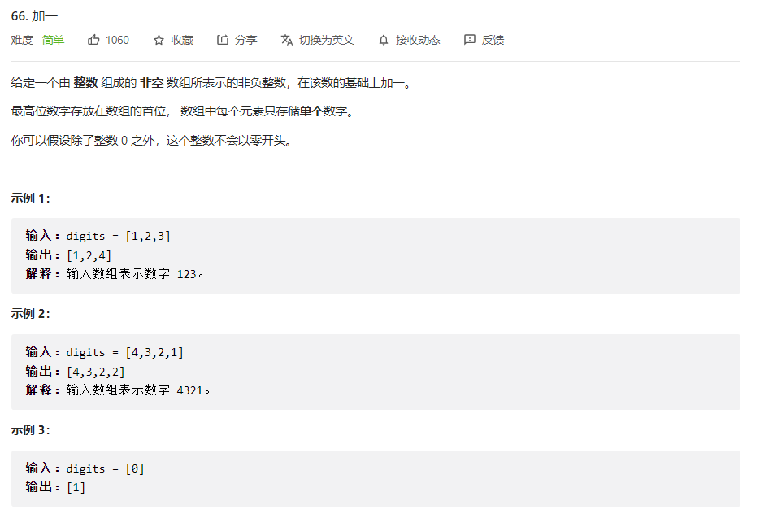

```javascript
function test(digits) {
   const len = digits.length;
   for (let i = len - 1; i >= 0; i--) {
       digits[i]++;
       digits[i] %= 10; // 10 % 10 = 0 (1 ~ 9) % 10 = (1 ~ 9)
       // 没有进位，直接返回
       if (digits[i] != 0) return digits;
       // 来到这里：说明前者加了1 导致要进位 故读取下一位进行加一
   }
   // 来到这里：说明 数组中所有值都为 0， 并且还少一位
   digits = [...Array(len + 1)].fill(0);
   // 补齐
   digits[0] = 1;
   return  digits;
}
console.log(test([9, 9, 9]))
```


<hr/>

### 2022-08-08

####  字符串转换整数


解法：

```javascript
    function test(s) {
        let flag = 1;
        let res = 0;
        let i = 0;
        // 过滤空格
        while (s.charAt(i) === '') i++;

        // 判断正负
        if (i < s.length && s.charAt(i) === '+') {
            i++;
        } else if (x < s.length && s.charAt(i) === '-') {
            i++;
            flag = -1;
        }

        while(i < s.length && s.charAt(i) <= '9' && s.charAt(i) >= '0') {
            let tmp = s.charAt(i) - 0;
            res = res * 10 + tmp;

            if (res <= -2147483648) return -2147483648;
            else if (res >= 2147483647) return 2147483647;
        }
        return res;
    }
```

补充：

```javascript
// 去除字符串内所有的空格：
str = str.replace(/\s*/g,"");
//去除字符串内两头的空格：
str = str.replace(/^\s*|\s*$/g,"");
// 去除字符串内左侧的空格：
str = str.replace(/^\s*/,"");
// 去除字符串内右侧的空格：
str = str.replace(/(\s*$)/g,"");
```

<hr>

####  盛最多水的容器


解法：双指针

* 从两端位置向中间靠拢，计算当前面积。
* 比较当前两端高度值，高度小的一边向中间靠拢。
* 当两端重合时，结束，输出最大面积

```javascript
function test(arr) {
    let l = 0;
    let r = arr.length - 1;
    let max = 0;
    while(l < r) {
        let maxArea = (r - l) * Math.min(arr[l], arr[r]);
        if (maxArea > max) max = maxArea;
        arr[l] < arr[r] ? l++ : r--;
    }
    return max;
}
```

<hr>

### 2022-08-09

#### 罗马数字转整数


解法：

* 根据罗马数字的特点：从左到右，值依次递减。
* 如果当前位置小于下一个值，则要减去该值，反则累加

```javascript
var romanToInt = function(s) {
  let obj = {
      "M": 1000,
      "D": 500,
      "C": 100,
      "L": 50,
      "X": 10,
      "V": 5,
      "I": 1
  }
  let res = 0;
  for (let i = 0; i < s.length-1; i++) {
      if (obj[s.charAt(i)] >= obj[s.charAt(i+1)]) {
          res += obj[s.charAt(i)]
      } else {
          res -= obj[s.charAt(i)]
      }
  }
  return res + obj[s.charAt(s.length-1)];
}
```

<hr>

#### 数字转罗马数字


解法：贪心算法

* 对整数做减法，每次都减去符合罗马数的最大值

```javascript
var intToRoman = function(num) {
    let arr = [
        {
            value: 1000,
            char: "M"
        },{
            value: 900,
            char: "CM"
        },{
            value: 500,
            char: "D"
        },{
            value: 400,
            char: "CD"
        },{
            value: 100,
            char: "C"
        },{
            value: 90,
            char: "XC"
        },{
            value: 50,
            char: "L"
        },{
            value: 40,
            char: "XL"
        },{
            value: 10,
            char: "X"
        },{
            value: 9,
            char: "IX"
        },{
            value: 5,
            char: "V"
        },{
            value: 4,
            char: "IV"
        },{
            value: 1,
            char: "I"
        }
    ];
    let res = "";
    for (let i = 0; i < arr.length && num >= 0; ++i) {
        // 减去最大值
        while (num >= arr[i].value) {
            num -= arr[i].value;
            res += arr[i].char;
        }
    }
    return res;
};
```

<hr>

### 2022-08-10


#### 最长前缀码

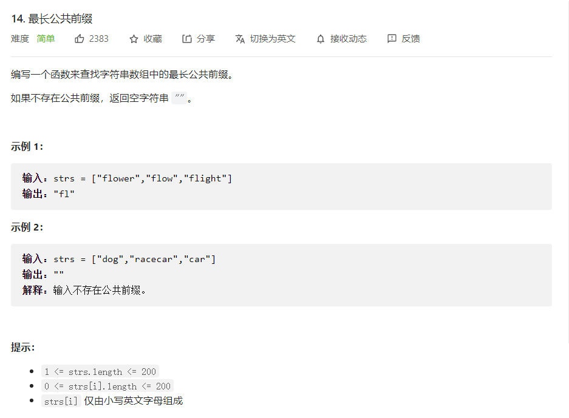

解法：

* 取最短的字符串为基本比较的字符串
* 遍历数组（从第二个位置开始遍历）
* 遍历字符串，每一个位置进行比较，不等则结束比较

```javascript
var longestCommonPrefix = function(strs) {
    if(strs.length == 0) return "";
    // 排序（降序）
    strs.sort((a, b) => a.length - b.length);
    // 取标志点
    let ans = strs[0];
    // 遍历数组（从第二个开始）
    for(let i = 1;i < strs.length; i++) {
        let j = 0;
        // 遍历字符串
        for(;j < ans.length && j < strs[i].length; j++) {
            if(ans[j] != strs[i][j]) break;
        }
        ans = ans.substr(0, j);
        if(ans === "") return ans;
    }
    return ans;
};
```

<hr/>

#### 最接近的三数之和

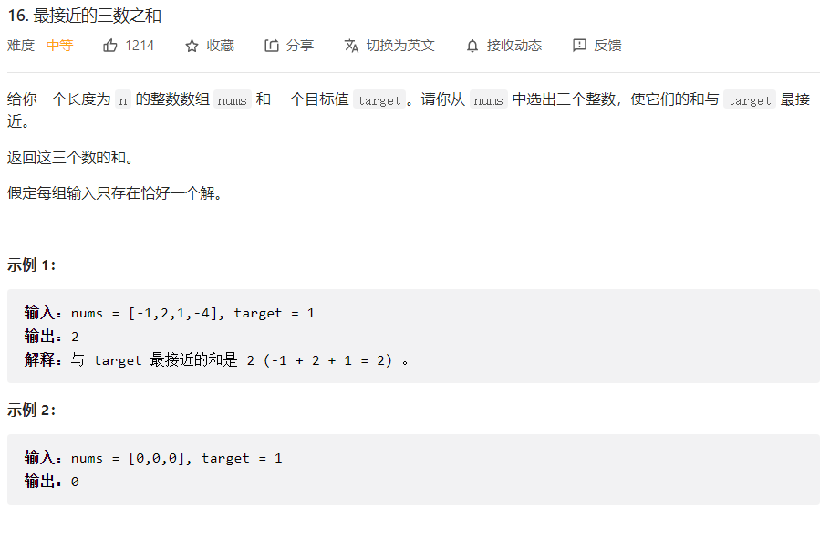

解法：采用双指针的方式

* 对数组进行升序排序
* 遍历数组，从第 i 点开始作为三个值的其中一个，将左指针定位到第 i + 1，右指针定位到 nums.length - 1;
* 每次遍历，计算当前三者值，与目标值（target）更接近则保存该值
* 比目标值小，则左指针右移。
* 比目标值大，则右指针左移。

```javascript
/**
 * @param {number[]} nums
 * @param {number} target
 * @return {number}
 */
var threeSumClosest = function(nums, target) {
    // 升序排
    nums.sort((a, b) => a - b);
    // 假设前三最接近目标值
    let ans = nums[0] + nums[1] + nums[2];
    for (let i = 0; i < nums.length; i++) { // 遍历数组
        let l = i + 1; // 左指针
        let r = nums.length - 1; // 右指针
        while(l < r) {
            // 计算此轮循环的当前值
            let sum = nums[i] + nums[l] + nums[r];
            // 比较，谁更接近目标值
            if (Math.abs(target - sum) < Math.abs(target - ans)) ans = sum;
            // 比目标值大
            if (sum > target) r--;
            // 比目标值小
            else if (sum < target) l++;
            // 等于目标值，直接返回
            else return ans
        }
    }
    return ans;
};
```

<hr>

### 2022-08-11


#### 四数之和

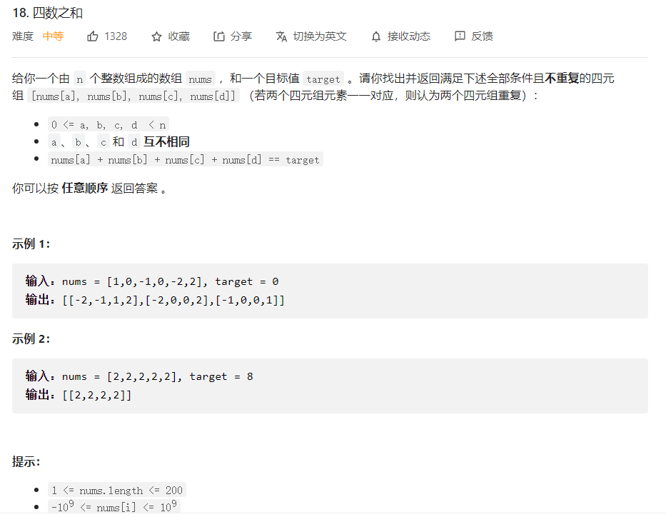

解法：双指针

* 跟三数和类型，只不过在多一层循环

```javascript
function test(nums, target) {
  let res = [];

  // 特殊情况判断
  if (nums == null || nums.lengths < 4) return res;

  // 升序
  nums.sort((a, b) => a - b);
 
  let len = nums.length;
  for (let a = 0; a < len - 3; a++) {
    
    // 确保第一个元素变了，并固定其值
    if (a > 0 && nums[a] == nums[a - 1]) continue;

    // 固定第二值
    for (let b = a + 1; b < len - 2; b++) {
       // 确保第二个元素变了，并固定其值
       if (b > a + 1 && nums[b] == nums[b - 1]) continue;
       
       // 确认双指针
       c = b + 1;
       d = len - 1;

       while (c < d) {
          // 计算此时四个值
          let sum = nums[a] + nums[b] + nums[c] + nums[d];
          if (sum < target) {
            c++;
          }else if (sum > target) {
            d--;
          } else {
            res.push([nums[a], nums[b], nums[c], nums[d]]);

            // 对左右指针进行移动
            while (c < d && nums[c] == nums[c +1]) {
                c++;
            }
            while(c < d && nums[d] == nums[d - 1]) {
                d--
            }
            c += 1;
            d -= 1;
          }
       }
    }
  }
  return res;
}
let nums =  [1, 0, -1, 0, -2, 2];
let target = 0;
console.log(test(nums, target))
```

<hr/>

#### 有效括号

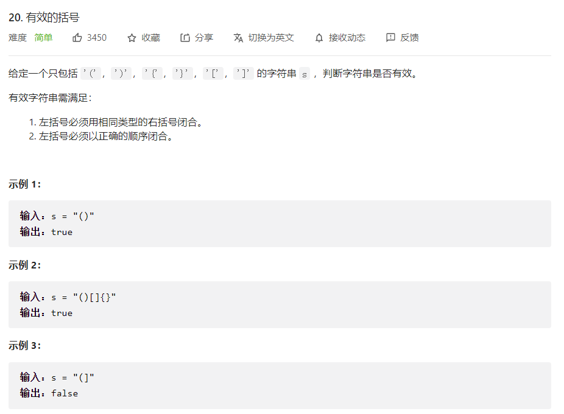

解法：使用栈

```javascript
/**
 * @param {string} s
 * @return {boolean}
 */
var isValid = function (str) {
  let stack = [];
  for (let i = 0; i < str.length; i++) {
    let tmp = str.charAt(i);
    // 入栈
    if (tmp == '(' || tmp == '{' || tmp == '[') {
      stack.push(tmp);
    } else {
      let top = stack[stack.length == 0 ? 0 : stack.length - 1]
      if (tmp == ')' && stack.length != 0 && top == '(') {
        stack.pop();
      } else if (tmp == '}' && stack.length != 0 && top == '{') { 
        stack.pop();
      } else if (tmp == ']' && stack.length != 0 && top == '[') {
        stack.pop();
      } else {
        return false;
      }
    }
  }
  console.log(stack);
  return stack.length == 0;
};
```

<hr>

### 2022-08-12


#### 括号生成

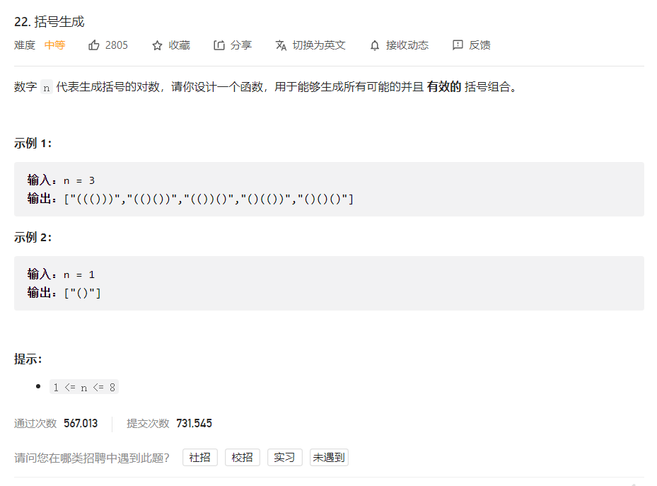

* 解法：回溯算法（树形结构）

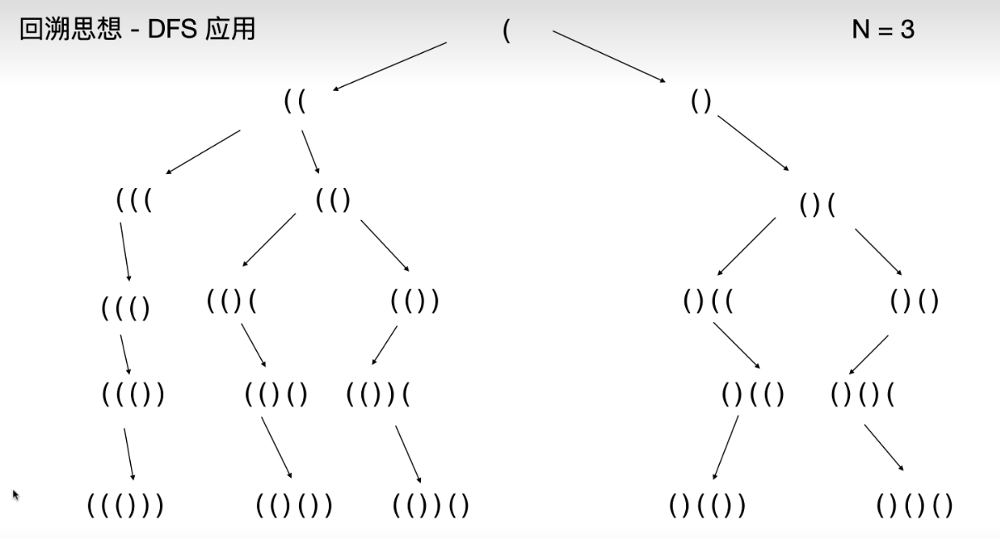

结束递归条件：str.length == 2n;

左括号个数以及右括号个数为 n: n;

添加左括号的条件：只要当前有剩余左括号，就添加。

添加右括号的条件：只要右括号剩余数量比左括号剩余数量多，就添加。

```javascript
  /**
   * 
   * @param {Number} l 左括号个数 
   * @param {*} r 右括号个数
   * @param {*} str 当前字符串
   * @returns 
   */
  const dfs = (l, r, str) => { 
    // 结束递归
    if (str.length == 2 * n) { 
      res.push(str);           
      return;                  
    }

    // 左括号还有，继续添加左括号
    if (l > 0) dfs(l - 1, r, str + "(");
    
    // 右括号比左括号剩的多，才能选右括号
    if (l < r) dfs(l, r - 1, str + ")"); 
  };

  dfs(n, n, "");
  return res;
};
```

<hr/>

#### 电话号码的字母组合

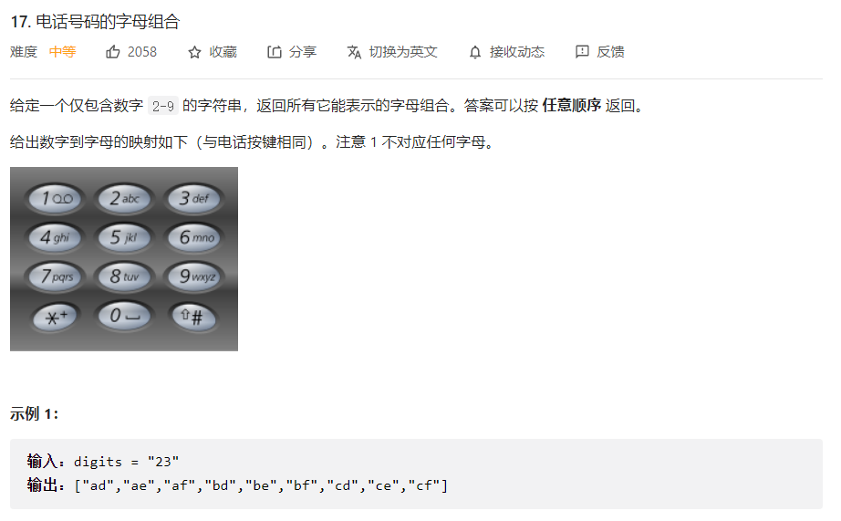

* 解法：回溯算法（树形结构）

结束递归条件 str.length == digits.length;

```javascript
/**
 * @param {string} digits
 * @return {string[]}
 */
var letterCombinations = function(digits) {
    let list = [];
    if (digits.length == 0) return [];
    let obj = {
            "2": "abc",
            "3": "def",
            "4": "ghi",
            "5": "jkl",
            "6": "mno",
            "7": "pqrs",
            "8": "tuv",
            "9": "wxyz"
    }
    /**
     * @param {string} str 当前字符串
     * @return {} index 当前 digits 对应的下标
     */
    var dfs = function (str, index) {
        // 符合条件，结束递归
        if (str.length == digits.length) {
           list.push(str);
           return;
        }
        // 取出数字对应的字符串
        let s = obj[digits.charAt(index)];
        for(let i = 0; i < s.length; i++) {
          dfs(str + s.charAt(i), index + 1);
        }
    }
    dfs("", 0);
    return list;
};
```

<hr>

### 2022-08-13


####  删除数组中重复的数字

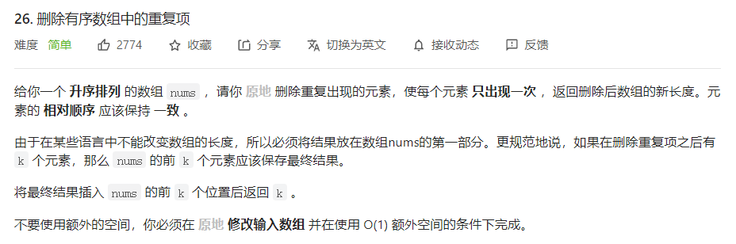

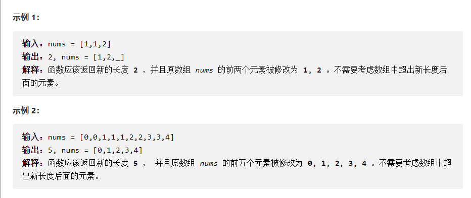

解法：双指针`fast`、`slow`

起始点：俩指针都从数组下标为1开始

结束标志：到达数组尾部

slow 所指位置代表从 0 ~ (slow - 1) 没有重复的数字，slow位置代表当前可能需要被替换

fast 代表下一个数字

```javascript
/**
 * @param {number[]} nums
 * @return {number}
 */
var removeDuplicates = function(nums) {
    let len = nums.length;
    if (len == 0) return [];
    
    let fast = 1;
    let slow = 1; // 待替换位置
    while (fast < len) {
        
        if (nums[fast] !== nums[fast - 1]) {
            // 当前 slow 前（包括slow）都不重复
            nums[slow] = nums[fast];
            // 指向下一个待替换位置
            ++slow;
        }
        // 继续前进
        ++fast;
    }
    return slow
};
```

<hr/>

#### 串联所有单词的子串

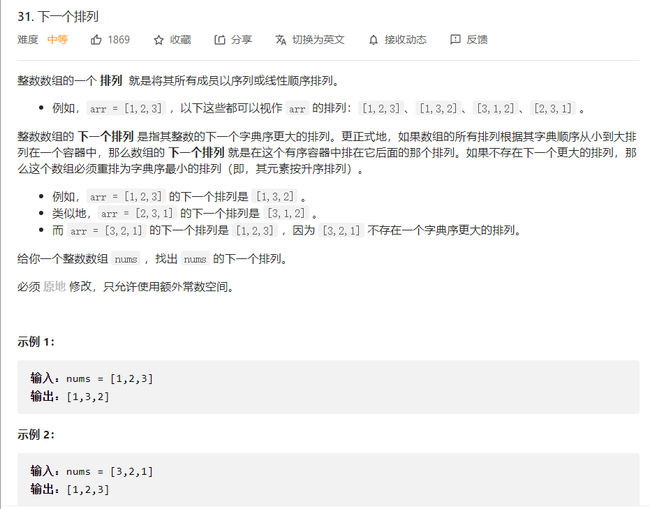

解法：

* 遍历 s 从 i = 0 开始截取 `words.length * words[0].length` 长度的字符串`curS`
* 在遍历 words 根据 单词长度（words）从`curS`中截取 words[j].length的字符串`curChild`
* 判断 words 是否存在该单词 `curChild`,存在则移除，再次截取，进行判断
* 不存在，则该起始位置不对

```javascript
/**
 * @param {string} s
 * @param {string[]} words
 * @return {number[]}
 */
var findSubstring = function(s, words) {
   if (words.length == 0) return [];

   // 计算单词总长度
   let wordsLen = words.length * words[0].length;
   if (s.length < wordsLen) return  [];

   let resArr = [];
   // 每个单词长度
   let childLen = words[0].length;

   // 拷贝
   let wordsCopy;
   for (let i = 0; i <= s.length - wordsLen; i++) {
       // 从匹配串截取 单词总长度 的字符串
       let curS = s.slice(i, i+wordsLen);
       console.log("curS字符串为", curS);

       let is_Target = true;
       wordsCopy = [...words];

       for (let j = 0; j <= wordsLen-childLen; j+= childLen) {
           // 截取第 j 个单词出来
           let curChild = curS.slice(j, j+childLen);
           console.log(`从 curS 截取的第${j + 1}个单词为`, curChild);

           // 判断在 wordsCopy 中是否存在
           let index = wordsCopy.indexOf(curChild);
           if (index !== -1) {
               // 存在，移除
               wordsCopy.splice(index, 1);
           } else {
               is_Target = false;
               break;
           }
       }
       console.log("-----------------");
       if (is_Target) resArr.push(i);
   }
   return resArr;
};
```


<hr>

### 2022-08-14


####  移除元素

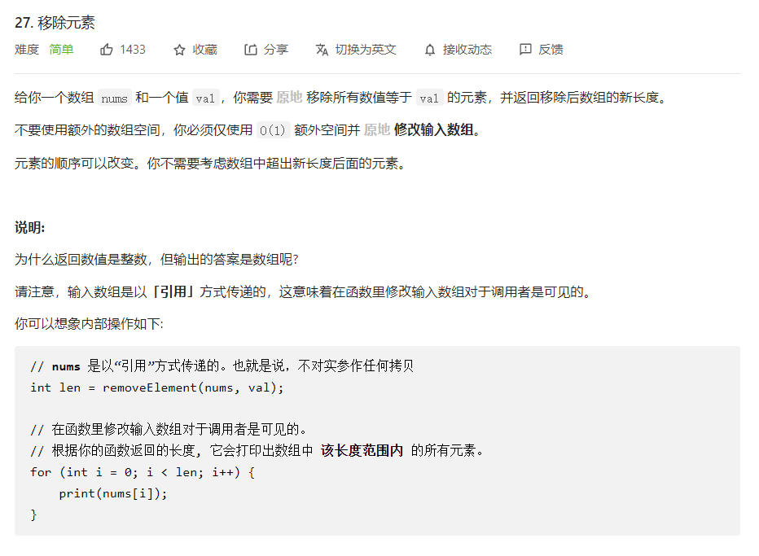

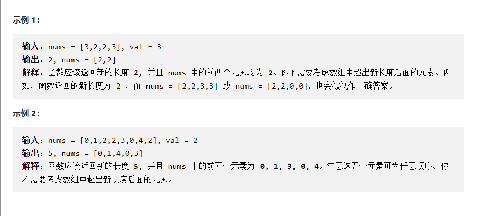

解法：双指针（快慢指针）跟 `删除数组中重复的数字`类似

```javascript
var removeElement = function(nums, val) {
    const n = nums.length;
    let left = 0;
    for (let right = 0; right < n; right++) {
        if (nums[right] !== val) {
            nums[left] = nums[right];
            left++;
        }
    }
    return left;
};
```

<hr/>

#### 合并K个升序链表

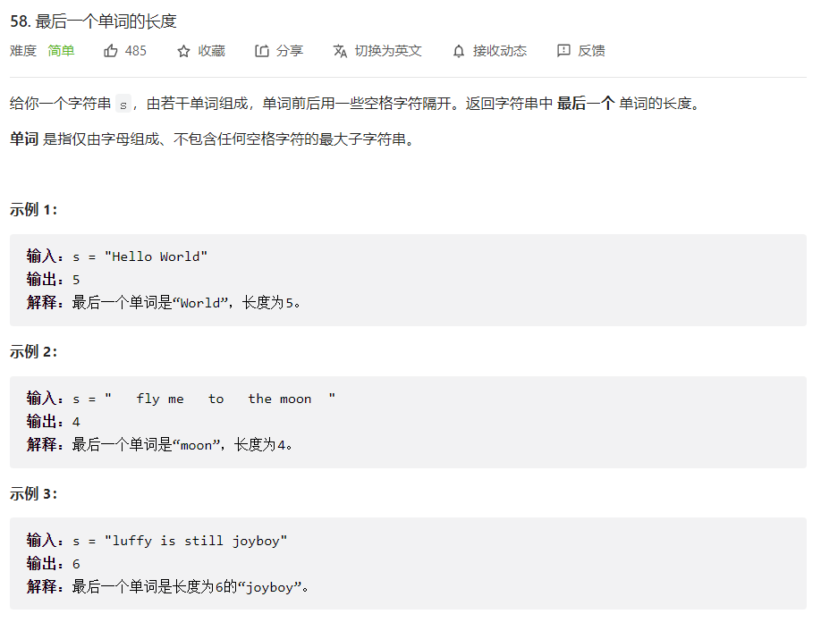

解法：

* 遍历 list 数组中的每一条链表，根据当前链表头获取其最小值，并把该值插入到新的链表中

* 并且在该链表找到该最小值时，需要将链表下移（`list[minIndex] = list[minIndex].next`），为下一次寻找最小值做准备

  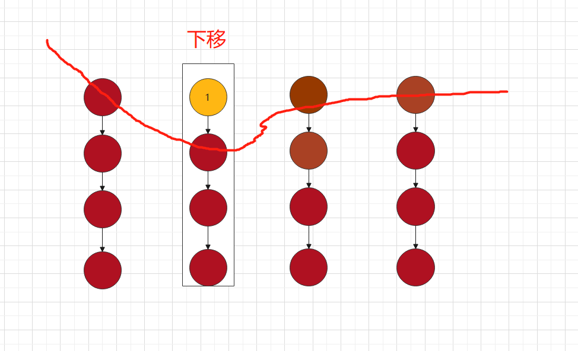

```javascript
/**
 * Definition for singly-linked list.
 * function ListNode(val, next) {
 *     this.val = (val===undefined ? 0 : val)
 *     this.next = (next===undefined ? null : next)
 * }
 */
/**
 * @param {ListNode[]} lists
 * @return {ListNode}
 */
var mergeKLists = function(lists) {
   // 头部
   let head = null;
   let temp = null;
   while (true) {
       // 当前最小值下标
       let = minIndex = -1;
       for (let i = 0; i < lists.length; i++) {
          if (lists[i] != null) {
              if (minIndex == -1) { // 初始化
                  minIndex = i;
              } else {
                  if (lists[i].val < lists[minIndex].val) minIndex = i;
              }
          }
       }
       if (minIndex == -1) break; // 结束

       // 找到最小值
       if (head == null) {
           head = lists[minIndex];
           temp = head;
       } else {
           temp.next = lists[minIndex];
           // 为下一次循环做准备
           temp = temp.next;
       }
       // 把当前最小值的位置下移（未下一次寻找最小值做准备）
       lists[minIndex] = lists[minIndex].next;
   }
   return head;
};
```


<hr>

### 2022-08-15

#### 实现strStr()

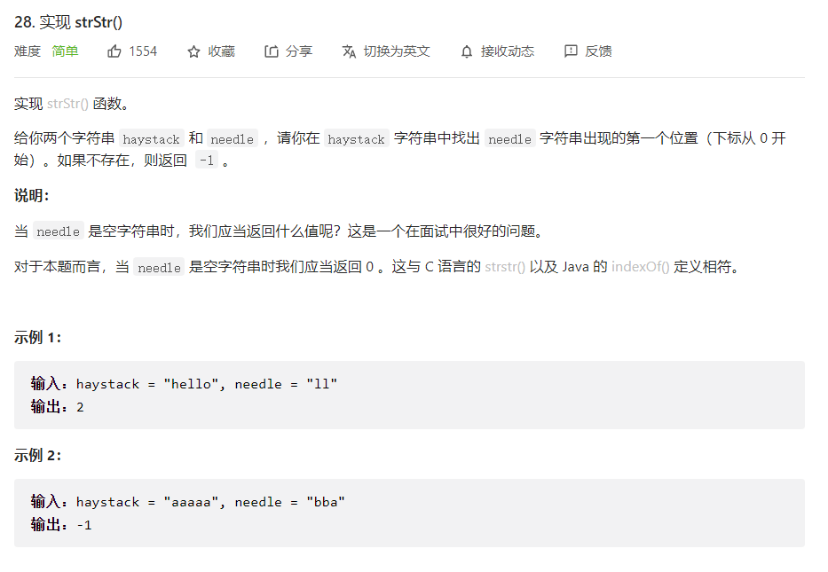

解法：遍历字符串，进行比较

```javascript
var strStr = function(haystack, needle) {
    let hayLen = haystack.length;
    let needlen = needle.length;
    if(needlen == 0) return 0;
    let i = 0;
    let j = 0;
    while(i < hayLen && j < needlen) {
        if (haystack.charAt(i) == needle.charAt(j)) {
            i++;
            j++;
        } else {
            // i - j 回退之前前进的距离 j +1 在前进一个位置，变相遍历 haystack
            i = i - j + 1;
            j = 0;
        }
    }
    if (j == needlen) return i - j;
    return  -1;
};
console.log(strStr("Hello", "ll"));
```

<hr>

### 2022-08-16


#### 俩数整除

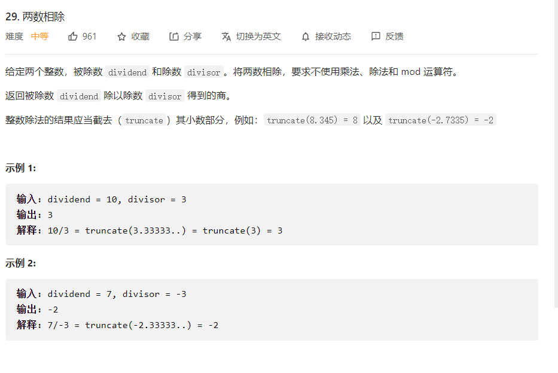

解法：由于无法使用相除，可以使用相减，但由于时间限制，因此，可以采用左移的形式，计算出被除数可以被减去最大数.

```javascript
var divide = function(dividend, divisor) {
  if (divisor === 0) return Infinity;
  if (dividend === 0) return 0;
  if (dividend === -2147483648 && divisor === -1) return 2147483647;

  let res = 0;
  let flag = '';
  if (dividend < 0 && divisor > 0 || dividend > 0 && divisor < 0) flag = '-';
  
  dividend = Math.abs(dividend);
  divisor = Math.abs(divisor);
  
  while (dividend >= divisor) {
      let temp = divisor, m = 1;

      // 计算出最大值
      while (temp <= (dividend >> 1)) { 
          temp <<= 1; // temp = temp * 2;
          m <<= 1; // m = m * 2;
      }

      dividend -= temp;
      res += m;

      // dividend 可能还可以再减去多个 divisor，故再次执行一次 while
  }

  return parseInt(flag + res);
};
console.log(divide(1, 1))
```

<hr/>

#### 搜索插入位置

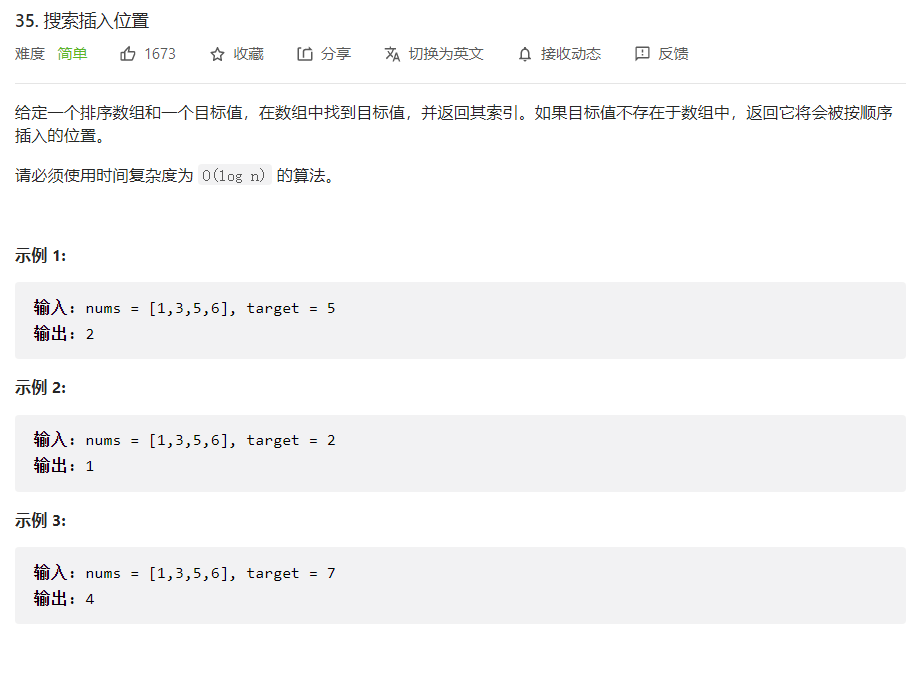

解法：双指针

```javascript
var searchInsert = function(nums, target) {
    const n = nums.length;
    let left = 0, right = n - 1, ans = n;
    while (left <= right) {
        let mid = ((right - left) / 2) + left;
        if (target <= nums[mid]) {
            ans = mid;
            right = mid - 1;
        } else {
            left = mid + 1;
        }
    }
    return ans;
};
```


<hr/>

### 2022-08-17

#### 下一个排列


解法：

* 从数组的倒数第二个开始寻找 `arr[i] < arr[i + 1]`；找到后，将其保存在`变量 temp` 中
* 如找到该值，则再次从数组倒数第一个向左找到第一个比`temp`小的数，两者进行交换位置，并在 temp所在位置（i）后面的所有数字倒叙排
* 如未找到，则说明已经是最大值，直接倒叙排

```javascript
var nextPermutation = function(arr) {
    let swap = (arr, i, j) => {
		let temp = arr[i];
		arr[i] = arr[j];
		arr[j] = temp;
	}
	let reverse = (arr, start) => {
		let left = start;
		let right = arr.length - 1;
		while (left < right) {
			swap(arr, left, right);
			left++;
			right--;
		}
	}

    let len = arr.length;
    let i = len - 2; // 倒数第二个数开始

	// 找到 左边值小于右边值
	while(i >= 0 && arr[i] >= arr[i+1]) {
		i--;
	}
	if (i >= 0) { // 找到
		let j = len - 1; // 倒数第一个数开始

		// 再从右到左找比arr[i] 小的数
		while(j >= 0 && arr[i] >= arr[j]) {
			j--;
		}
		// 交换
		swap(arr, i, j);
	}
    
	// 后面值倒排
	reverse(arr, i+1);
	return arr;
};
```

<hr/>
### 2022-08-18

#### 最长有效括号

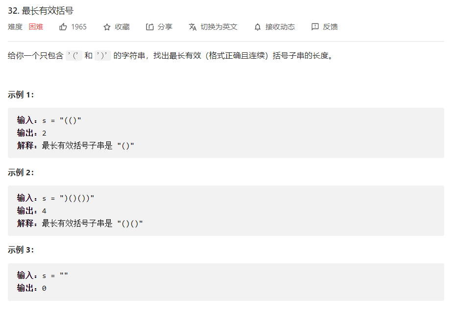

解法：

初始栈时，在栈底设置一个哨兵 -1

- 遍历字符串 s
  - 每次遇到 `(` 直接把**下标**压入栈中
  - 若遇到 ) 则要从栈顶取出元素
    - 取出元素后，判断栈是否为空
      - 为空，说明刚才取出的元素是哨兵（右括号）。此时说明从当前哨兵为起始点，匹配最长的括号已经结束。把刚才从`s`出来的字符串对应数组下标存入到栈中，代表新的哨兵（右括号）。
      - 不为空，说明，可以匹配成功，更新最长有效括号长度（当前下标 - 取出栈顶的下标值）

```javascript
/**
 * @param {string} s
 * @return {number}
 */
var longestValidParentheses = function(s) {
    if (s.length == 0) return 0;

    let res = [-1];
    let max = 0;
    let len = s.length;
    for (let i = 0; i < len; i++) {
        let temp = s.charAt(i);
        if (temp == "(") {
            res.push(i)
        } else {
            res.pop();

            if (res.length == 0) {
              res.push(i);
            } else {
               max  = Math.max(max, i - res[res.length - 1])
            }
        }
    }
    return max;
};
```

<hr/>

### 2022-08-19

#### 最后一个单词长度


```javascript
/**
 * @param {string} s
 * @return {number}
 */
var lengthOfLastWord = function(s) {
     
     let len = s.length;
     let i = len - 1;
     let num = 0;
     while (i >= 0 && s.charAt(i) == " ") {
         i--;
     }
     while  (i >= 0 && s.charAt(i) != " ") {
        ++num;
        --i;
     }
     return num;
};
```

<hr/>

### 2022-08-20

#### 俩两交换链表中的节点

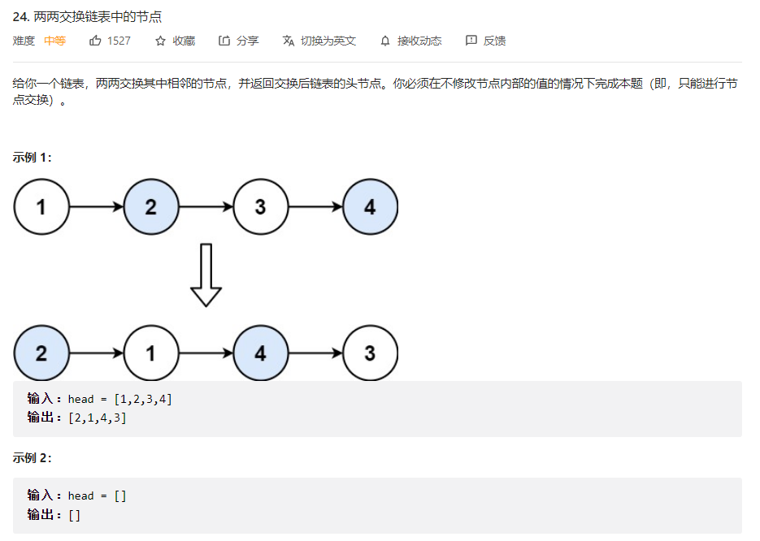

解法：

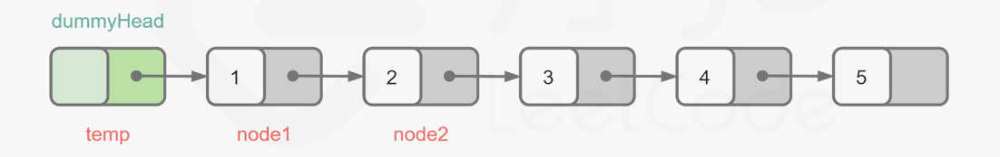

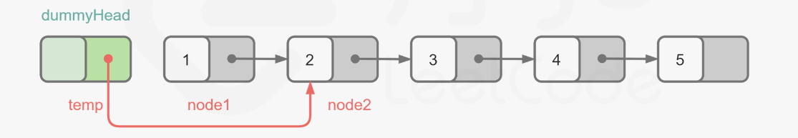

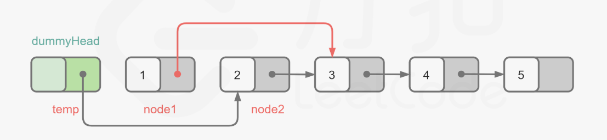

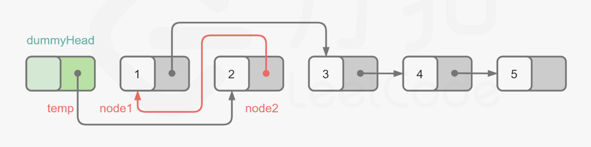

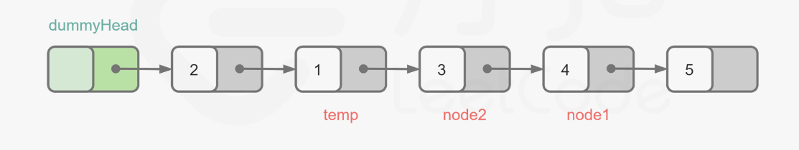

```javascript
/**
 * Definition for singly-linked list.
 * function ListNode(val, next) {
 *     this.val = (val===undefined ? 0 : val)
 *     this.next = (next===undefined ? null : next)
 * }
 */
/**
 * @param {ListNode} head
 * @return {ListNode}
 */
var swapPairs = function(head) {
   const dummyHead = new ListNode(0);
    dummyHead.next = head;
    let temp = dummyHead;
    while (head && head.next) {
        const node1 = head;
        const node2 = head.next;

        temp.next = node2;
        node1.next = node2.next;
        node2.next = node1;

        temp = node1;
        head = head.next;
    }
    return dummyHead.next;
};
```

<hr/>

### 2022-08-21

#### 反转链表

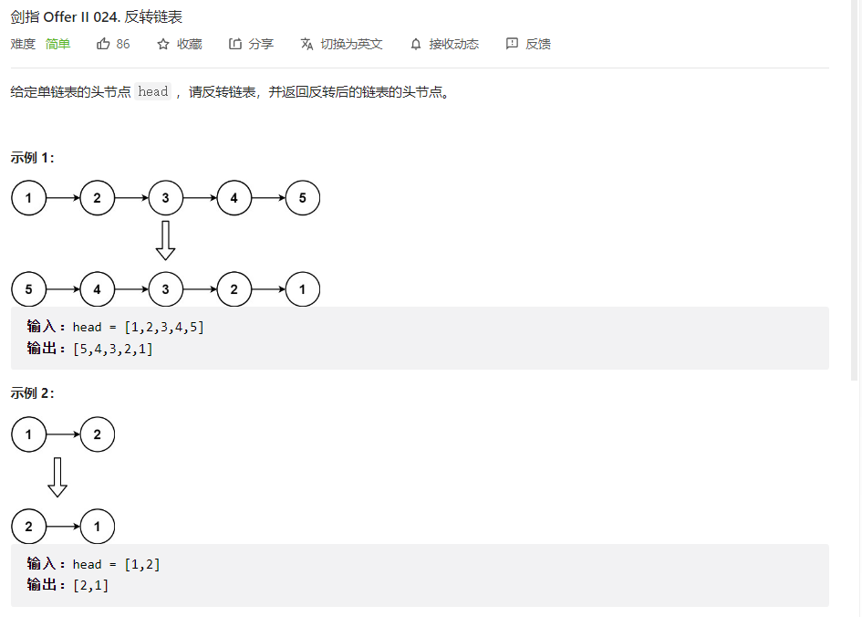

```javascript
/**
 * Definition for singly-linked list.
 * function ListNode(val, next) {
 *     this.val = (val===undefined ? 0 : val)
 *     this.next = (next===undefined ? null : next)
 * }
 */
/**
 * @param {ListNode} head
 * @return {ListNode}
 */
var reverseList = function(head) {
    // 当前节点
    let cur = head;
    // 上一个节点
    let prev = null;
    while(cur !== null) {
      // 下一个节点
      let next = cur.next;
      // 当前节点next指向上一个节点
      cur.next = prev;
      
      // 更新
      prev = cur;
      cur = next;
    }
    return prev;
};
```

<hr/>


### 2022-08-22

<hr/>


### 2022-08-23

<hr/>


### 2022-08-24

<hr/>


### 2022-08-25

<hr/>


### 2022-08-26

<hr/>


### 2022-08-27

<hr/>


### 2022-08-28

<hr/>


### 2022-08-29

<hr/>


### 2022-08-30

<hr/>


### 2022-08-31

<hr/>