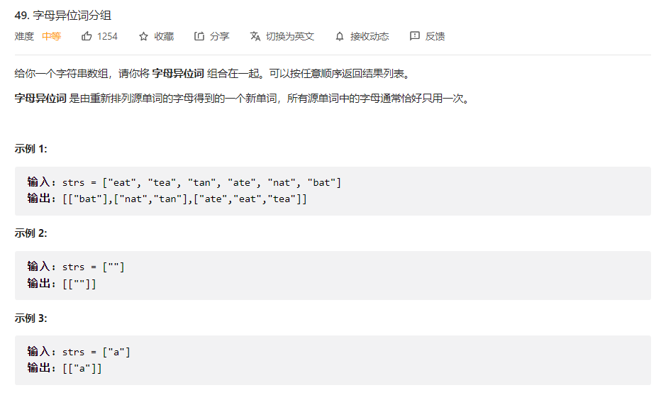

### 2022-09-01

#### 外观数列


```javascript
/**
 * @param {number} n
 * @return {string}
 */
var countAndSay = function(n) {
    if(n == 1) return "1";
    // 上一串字符串
    let prevSeq = countAndSay(n - 1);
    
    // 返回结果
    let res = "";

    // 上一个数字
    let lastNum = prevSeq.charAt(0);
    // 出现的次数
    let numCount = 0;

    for (let i = 0; i < prevSeq.length; i++) {
        if (prevSeq.charAt(i) == lastNum) {
            ++numCount;
        } else {
            res += numCount;
            res += lastNum;

            // 更新上一个数字
            lastNum = prevSeq.charAt(i);
            numCount = 1;
        }

        // 特殊情况
        if (i == prevSeq.length - 1) {
            res += numCount;
            res += lastNum;
        }
    }
    return res;
};
```

<hr/>

#### 组合总合


```javascript
/**
 * @param {number[]} candidates
 * @param {number} target
 * @return {number[][]}
 */
var combinationSum = function(candidates, target) {
      // 升序
      candidates.sort((a, b) => a - b);
      // 结果
      let res = [];
     
     let dfs = function (start, target, comine) {
         // 满足条件
         if (target == 0) {
             res.push([...comine])
         }

         for(let i = start; i < candidates.length; i++) {
             // 当前值大于目标值，无需添加
             if (target < candidates[i]) return;
             // 该值可能满足条件
             comine.push(candidates[i]);
             dfs(i, target - candidates[i], comine);
             comine.pop(); // 回溯
         }
     }
     dfs(0, target, []);
     return res;
};
```

### 2022-09-02

#### 组合总和II


```javascript
/**
 * @param {number[]} candidates
 * @param {number} target
 * @return {number[][]}
 */
var combinationSum2 = function(candidates, target) {
     candidates.sort((a, b) => a - b);
     let res = [];
     let dfs = function (start, target, combin) {
         // 剪枝
         if (target == 0) res.push([...combin]);

         for(let i = start; i < candidates.length; i++) {
             if (candidates[i] > target) break;
             // 打头元素不能相同，不然重复
             if (i > start && candidates[i] === candidates[i - 1])continue;

             combin.push(candidates[i]);
             dfs(i+1, target - candidates[i], combin);
             combin.pop();
         }
         
     }
     dfs(0, target, []);
     return res;
};
```

#### 组合总和III


```javascript
/**
 * @param {number} k
 * @param {number} n
 * @return {number[][]}
 */
var combinationSum3 = function(k, n) {
   let candidates = [1, 2, 3, 4, 5, 6, 7, 8, 9];
   let res = [];
   let dfs = function(start, target, combin) {
       if (combin.length == k && target == 0) {
           res.push([...combin]);
           return;
       }

       for(let i = start; i < candidates.length; i++) {
           if(candidates[i] > target) break;

           if (i > start && candidates[i] == candidates[i - 1]) continue;

           combin.push(candidates[i])
           dfs(i + 1, target - candidates[i], combin);
           combin.pop();
       }

   }
   dfs(0, n, []);
   return res;
};
```

<hr/>

### 2022-09-03

#### 解数独


```javascript
/**
 * @param {character[][]} board
 * @return {void} Do not return anything, modify board in-place instead.
 */
var solveSudoku = function (board) {
  function isValid(row, col, val, board) {
    // 行不能重复
    for (let i = 0; i < 9; i++) {
      if (board[row][i] === val) return false
      
    }
    // 列不能重复
    for (let i = 0; i < 9; i++) {
      if (board[i][col] === val) return false
    }
    let boxRow = Math.floor(row / 3) * 3
    let boxCol = Math.floor(col / 3) * 3

    for (let i = boxRow; i < boxRow + 3; i++) {
      for (let j = boxCol; j < boxCol + 3; j++) {
        if (board[i][j] === val) return false
        
      }
    }

    return true
  }

  let helper = function () {
    for (let i = 0; i < 9; i++) {
      for (let j = 0; j < 9; j++) {
        if (board[i][j] !== ".") continue;
        for (let val = 1; val <= 9; val++) {
          if (isValid(i, j, `${val}`, board)) {
            board[i][j] = `${val}`
            if (helper()) return true;
            board[i][j] = "."
          }
        }
        return false;
      }
    }
    return true;
  }
  helper();
  return board;
};
```

#### 接雨水


```javascript
/**
 * @param {number[]} height
 * @return {number}
 */
var trap = function(height) {
    let res = 0;
    let l = 0; 
    let r = height.length - 1;

    let lmax = 0; // 左边最大值
    let rmax = 0; // 右边最大值

    while(l < r) {
        // 更新最大值
        lmax = Math.max(lmax, height[l]);
        rmax = Math.max(rmax, height[r]);

        if (lmax < rmax) { // 左边短于右边
            res += (lmax - height[l])
            l++;
        } else { // 右边短于左边
           res += (rmax - height[r])
           r--;
        }
    } 
    return res;
};
```

<hr/>

### 2022-09-04

#### 缺失的第一个正数


```javascript
/**
 * @param {number[]} nums
 * @return {number}
 */
var firstMissingPositive = function(nums) {
     let len = nums.length;
     let swap = function(nums, i, j) {
         let temp = nums[i];
         nums[i] = nums[j];
         nums[j] = temp;
     }

     // 将每一个值找到对应桶的位置
     for (let i= 0; i < len;) {
         let val = nums[i];
         if (val > 0 && val <= len && val != i + 1 && nums[val - 1] != val) {
             swap(nums, i, val - 1);
         } else {
             i++;
         }
     }

     // 找每一个桶是否位置对应
     for(let i = 0; i < len; i++) {
         if (nums[i] != i + 1) return i + 1;
     }
     return len + 1;
};
```

#### 字符串相乘


```javascript
/**
 * @param {string} num1
 * @param {string} num2
 * @return {string}
 */
var multiply = function(num1, num2) {
     if (num1 == '0' || num2 == '0') return '0';

     let len1 = num1.length;
     let len2 = num2.length;

     // 结果数组
     let res = new Array(len1 + len2).fill(0);

     for (let i = len1 - 1; i >= 0; i--) {
         for (let j = len2 - 1; j >= 0; j--) {
             const mul = num1[i] * num2[j];
             // 乘积在结果数组的位置
             const p1 = j + i;
             // 进位位置
             const p2 = i + j + 1; 

             const sum = res[p2] + mul;
             res[p1] += Math.floor(sum / 10);
             res[p2] = sum % 10
         }
     }

     if (res[0] == 0) res.shift()
     return res.join("")
};
```

<hr/>

### 2022-09-05

#### 跳跃游戏


```javascript
/**
 * @param {number[]} nums
 * @return {boolean}
 */
var canJump = function(nums) {
    let len = nums.length;
    // 距离
    let distance = len - 1; 
    // 倒数第二个开始
    let last = len - 2;

    for (let i = last; i >= 0; i--) {
        // nums[i] + i 代表当前位置（i）能够到达最远右边的距离
        if (nums[i] + i >= distance) {
          // 进入到这里，说明当前 i 可以到达最右边
          
          // 接着distance更新为（最左边到达i的距离） 
          distance = i;

          // 判断i之前有哪些点可以到达 i，由此循环
        }
    }
    // 遍历完数组， distance 为 0 说明可以进行跳跃
    return distance === 0;
  }
```

#### 跳跃游戏II


```javascript
/**
 * @param {number[]} nums
 * @return {number}
 */
var jump = function(nums) {
    // 最远距离
    let maxPos = 0;
    // 最远点
    let end = 0;
    // 步长
    let ans = 0;
    for(let i = 0; i < nums.length - 1; i++) {
        maxPos = Math.max(maxPos, nums[i] + i);
        if (i == end) { // 到达最远边界
            end = maxPos;
            ans++;
        }
    }
    return ans;
};
```

<hr/>

### 2022-09-06

#### 全排列


```javascript
/**
 * @param {number[]} nums
 * @return {number[][]}
 */
var permute = function (nums) {
  let res = [];
  let dfs = function (nums, tmp, visited) {

    if (tmp.length == nums.length) {
      res.push([...tmp]);
      return;
    }

    for (let i = 0; i < nums.length; i++) {
      if (visited[i] == 1) continue;
      visited[i] = 1;

      tmp.push(nums[i]);

      dfs(nums, tmp, visited);

      visited[i] = 0;
      tmp.pop();
    }
  }
  dfs(nums, [], []);
  return res;
};
```

#### 全排列II


```javascript
var permuteUnique = function(nums) {
    const ans = [];
    const vis = new Array(nums.length).fill(false);
    const dfs = (size, tmp) => {
        if (size === nums.length) {
            ans.push([...tmp]);
            return;
        }

        for (let i = 0; i < nums.length; ++i) {
            if (vis[i] || (i > 0 && nums[i] == nums[i - 1] && !vis[i - 1])) {
                continue;
            }
            tmp.push(nums[i]);
            vis[i] = true;
            dfs(size + 1, tmp);
            vis[i] = false;
            tmp.pop();
        }
    }
    nums.sort((a, b) => a - b);
    dfs(0, []);
    return ans;
};
```

<hr/>

### 2022-09-07

#### 旋转图像


```javascript
/**
 * @param {number[][]} matrix
 * @return {void} Do not return anything, modify matrix in-place instead.
 */
var rotate = function(matrix) {

    // 对角翻转
    for (let i = 0; i < matrix.length; i++) {
        for (let j = 0; j < i; j++) {
            let temp = matrix[i][j];
            matrix[i][j] = matrix[j][i];
            matrix[j][i] = temp;
        }
    }
    // 左右交换
    for(let i = 0; i < matrix.length; i++) {
        for (let j = 0; j < Math.ceil(matrix.length / 2); j++) {
             let temp = matrix[i][j]; 
             matrix[i][j] = matrix[i][matrix.length - j - 1];
             matrix[i][matrix.length - j - 1] = temp;
        }
    }
    return matrix;
};
```

#### 字母异位分组



```javascript
/**
 * @param {string[]} strs
 * @return {string[][]}
 */
var groupAnagrams = function(strs) {
    let map = new Map();
    for (let i = 0; i < strs.length; i++) {

        // acb => abc 把 abc当作map的key值
        let key = strs[i].split('').sort().join('');

        if (!map.has(key)) map.set(key, [])

        map.get(key).push(strs[i]);
    }
    return [...map.values()];
};
```

<hr/>

### 2022-09-08

#### pow(x, n)


```javascript
var myPow = function(x, n) {
    if(n ==0 || n ==1) {
        return n == 0 ? 1: x
    }else if(n < 0){
        return myPow(1/x, Math.abs(n))
    }else{
        return n % 2 == 0 ? myPow(x * x , n/2) :  myPow(x * x ,Math.floor(n/2))* x
    }
};
```

#### 最大子数组和


```javascript
/**
 * @param {number[]} nums
 * @return {number}
 */
var maxSubArray = function(nums) {
    let ans = nums[0];
    let sum = 0;
    for(const num of nums) {
        if(sum > 0) {
            sum += num;
        } else {
            sum = num;
        }
        ans = Math.max(ans, sum);
    }
    return ans;
};
```

<hr/>

### 2022-09-09

#### 螺旋矩阵


```javascript
/**
 * @param {number[][]} matrix
 * @return {number[]}
 */
var spiralOrder = function(matrix) {
    let res = [];
    let m = matrix.length;
    let n = matrix[0].length;

    // 上边界
    let up = 0;
    // 下边界
    let down = m -1;
    // 左边界
    let left = 0;
    // 右边界
    let right = n - 1;

    // 遍历
    while(true) {
        // 从左到右
        for (let i = left; i <= right; i++) res.push(matrix[up][i]);
        // 上边界下移
        if (++up > down) break;
         
        // 从上到下
        for (let i = up; i <= down; i++) res.push(matrix[i][right]);
        // 右边界左移
        if (--right < left) break;

        // 从右到左
        for (let i = right; i >= left; i--) res.push(matrix[down][i]);
        // 下边界上移
        if (--down < up) break;

        // 从下到上
        for (let i = down; i >= up; i--) res.push(matrix[i][left]);
        // 左指针右移
        if (++left > right) break;
    }
    return res;
};
```

#### 螺旋矩阵II


```javascript
/**
 * @param {number} n
 * @return {number[][]}
 */
var generateMatrix = function(n) {
    let res = Array(n).fill().map(() => Array(n));

    // 上边界
    let up = 0;
    // 下边界
    let down = n -1;
    // 左边界
    let left = 0;
    // 右边界
    let right = n - 1;

    let cur = 1; 
    // 遍历
    while(true) {
        // 从左到右
        for (let i = left; i <= right; i++) res[up][i] = cur++;
        // 上边界下移
        if (++up > down) break;
         
        // 从上到下
        for (let i = up; i <= down; i++) res[i][right] = cur++;
        // 右边界左移
        if (--right < left) break;

        // 从右到左
        for (let i = right; i >= left; i--) res[down][i] = cur++;
        // 下边界上移
        if (--down < up) break;

        // 从下到上
        for (let i = down; i >= up; i--) res[i][left] = cur++;
        // 左指针右移
        if (++left > right) break;
    }
    return res;
};
```

<hr/>

### 2022-09-10

#### N皇后


```javascript
var solveNQueens = function(n) {
    // 当前填入的结果
    let tmp = new Array(n).fill(-1);

    // 最终返回的结果 res[i] = j 代表 在第 i 行 第 j 列放入皇后（行与列从0开始计算）
    let res = [];
    // 记录当前哪些位置不能放入皇后
    let cache = [];

    /**
     * 
     * @param {number} index 当前皇后在第几行 
     * @param {*} tmp 当前填入的结果
     * @param {*} cache 
     * @returns 
     */
    let dfs = function(index, tmp, cache) {
        // 最后一个皇后（结束）
        if (index == n) {
            res.push(tmp);
            return;
        }

        for (let i = 0; i < n; i++) {
           //该位置不能放皇后
            if (cache.indexOf(index + "," + i) > -1) continue;
            
            let arr = [...tmp];
            // 放入皇后（在 第 index 行 第 i 列）
            arr[index] = i;

            // 判断填入的皇后是否符合条件
            let f = 0;
            for (let p = 0; p < n; p++) {
                for (let q = 0; q < n; q++) {
                    
                    if (cache.indexOf(p + ',' + q) == -1) {
                        // 计算当 在 第 index 行 第 i 列放入皇后后，其他哪些位置不能放入皇后
                        if (index == p || i == q || p -index == q - i || p+ q == index + i) {
                            cache.push(p + ',' + q);
                            f++;
                        }
                    }
                }
            }
            dfs(index + 1, arr, cache);
            while(f--) cache.pop(); // 删除标记
        }
    }
    dfs(0, tmp, cache);
    return res.map(item => {
        let r = []
        item.map(a => {
            let str = ""
            for (let i = 0; i < n; i++)
                if (a === i) str += 'Q'
                else str += "."
            r.push(str)
        })
        return r
    })
}
console.log(solveNQueens(4));

```

#### N皇后II


```javascript
/**
 * @param {number} n
 * @return {number}
 */
var totalNQueens = function(n) {
    // 当前填入的结果
    let tmp = new Array(n).fill(-1);
    
    let nums = 0;
    // 记录当前哪些位置不能放入皇后
    let cache = [];

    /**
     * 
     * @param {number} index 当前皇后在第几行 
     * @param {*} tmp 当前填入的结果
     * @param {*} cache 
     * @returns 
     */
    let dfs = function(index, tmp, cache) {
        // 最后一个皇后（结束）
        if (index == n) {
            ++nums;
            return;
        }

        for (let i = 0; i < n; i++) {
           //该位置不能放皇后
            if (cache.indexOf(index + "," + i) > -1) continue;
            
            let arr = [...tmp];
            // 放入皇后（在 第 index 行 第 i 列）
            arr[index] = i;

            // 判断填入的皇后是否符合条件
            let f = 0;
            for (let p = 0; p < n; p++) {
                for (let q = 0; q < n; q++) {
                    
                    if (cache.indexOf(p + ',' + q) == -1) {
                        // 计算当 在 第 index 行 第 i 列放入皇后后，其他哪些位置不能放入皇后
                        if (index == p || i == q || p -index == q - i || p+ q == index + i) {
                            cache.push(p + ',' + q);
                            f++;
                        }
                    }
                }
            }
            dfs(index + 1, arr, cache);
            while(f--) cache.pop(); // 删除标记
        }
    }
    dfs(0, tmp, cache);
    return nums;
};
```

<hr/>

### 2022-09-11

#### 不同路径


```javascript
/**
 * i 为行 j 为列
 * 从左上角 -> 右下角 由于每次移动只能 向右（j + 1） 或者 向下 (i + 1)
 * 因此到达 dp[i][j] 取决于
 *     （1）从右方向过来的（即从 dp[i][j - 1] 过来） 
 *     （2）从下方向过来的（即从 dp[i - 1][j] 过来） 
 * 故路径总和 dp[i][j] = dp[i][j - 1] + dp[i -1][j];
 */
var uniquePaths = function(m, n) {
    let dp = new Array(m).fill(new Array(n).fill(1));
   
    for (let i = 1; i < m; i++) {
        for (let j = 1; j < n; j++) {
            dp[i][j] = dp[i - 1][j] + dp[i][j - 1];
        }
    }

    return dp[m - 1][n - 1];
}
console.log(uniquePaths(3, 7));
```

#### 不同路径II


```javascript
// 道理跟上述一致，只不过需要判断该位置是否有障碍，若有障碍 则 dp[i][j] = 0;
var uniquePathsWithObstacles = function (obstacleGrid) {
  let m = obstacleGrid.length
  let n = obstacleGrid[0].length
  let dp = Array(m).fill().map(item => Array(n).fill(0))

  //初始化
  for (let i = 0; i < m && obstacleGrid[i][0] === 0; i++) {
    dp[i][0] = 1
  }
  for (let j = 0; j < n && obstacleGrid[0][j] === 0; j++) {
    dp[0][j] = 1
  }
  for (let i = 1; i < m; i++) {
    for (let j = 1; j < n; j++) {
      if (obstacleGrid[i][j] === 0) {
        dp[i][j] = dp[i - 1][j] + dp[i][j - 1]
      } else {
        dp[i][j] = 0
      }
    }
  }
  return dp[m - 1][n - 1]
};
console.log(uniquePathsWithObstacles([[0], [1]]))
```

<hr/>

### 2022-09-12

#### 简化路径


```javascript
var simplifyPath = function(path) {
  const arr = path.split('/');
  // 栈
  const stack = [];

  const len = arr.length;

  for (let i = 0; i < len; i++) {
    if (arr[i] === "" || arr[i] === ".") {
       // 当前目录
       continue;
    } else if (arr[i] === "..") {
       // 上一层目录
       stack.pop();
    } else {
       // 下一层目录
       stack.push(arr[i]);
    }
  }
  return '/' + stack.join('/');
}

console.log(simplifyPath("/home/"));
console.log(simplifyPath("/../"));
console.log(simplifyPath("/a/./b/../../c/"));
console.log(simplifyPath("/home//foo/"));
console.log(simplifyPath("/a/../../b/../c//.//"));
console.log(simplifyPath("/a//bc/d//././/.."));
```

<hr/>

### 2022-09-13

#### 合并区间


```javascript
function getMerge(arr) {
    arr.sort((a, b) => {
        if (a[0] !== b[0]) {
            return a[0] - b[0];
        }
        return a[1] - b[1];
    });

    let len = arr.length;
    let ans = [];
    
    let start;
    let end;

    for (let i = 0; i < len; i++) {
        let s = arr[i][0];
        let e = arr[i][1];
      
        if (start == undefined) {
            start = s;
            end = e;
        } else if (s <= end) { // 当前的起始值在区间【start, end】 中
            end = Math.max(e, end);
        } else {
            // 创建新的区间
            let part = [start, end];
            ans.push(part);
            
            // 更新
            start = s;
            end = e;
        }
    }

    if (start !== undefined) {
        let part = [start, end]
        ans.push(part)
    }
    return ans;
}
let data = [
    [1,3],[2,6],[8,10],[15,18]
]
console.log(getMerge(data));
```

#### 旋转链表


```javascript
/**
 * Definition for singly-linked list.
 * function ListNode(val, next) {
 *     this.val = (val===undefined ? 0 : val)
 *     this.next = (next===undefined ? null : next)
 * }
 */
/**
 * @param {ListNode} head
 * @param {number} k
 * @return {ListNode}
 */
var rotateRight = function(head, k) {
    if (!head) return null;

    let cur = head;

    // 链表头尾相连
    let n = 1;
    while(cur.next) {
        cur = cur.next;
        n++;
    }
    cur.next = head;

    // 指针后移
    for (let i = 0; i < n - k % n; i++) {
         cur = cur.next;
    }
    head = cur.next;
    
    // 断开链表
    cur.next = null;
    return head;
};
```

<hr/>

### 2022-09-14

#### 最小路径和


```javascript
/**
 * i 为行 j 为列
 * 从左上角 -> 右下角 由于每次移动只能 向右（j + 1） 或者 向下 (i + 1)
 * 因此到达 dp[i][j] 取决于
 *     （1）从右方向过来的（即从 dp[i][j - 1] 过来） 
 *     （2）从下方向过来的（即从 dp[i - 1][j] 过来） 
 * 故路径总和 dp[i][j] = dp[i][j - 1] + dp[i -1][j];
 * 
 * 而针对此题需要改变的地方在于
 * （1）需要从最右下角 -> 左上角 进行动态规划，由此起始位置为 qp[grid.length - 1][grid[0].length - 1]
 * （2）dp[i][j] = dp[i][j + 1] + dp[i + 1][j];
 * （3）最终返回结果 dp[0][0]
 */
var minPathSum = function(grid) {
    let m = grid.length;
    let n = grid[0].length;

    let dp = new Array(m).fill(new Array(n).fill(1));

    for (let i = m - 1; i >= 0; i--) {
        for (let j = n - 1; j >= 0; j--) {
            if (i === m - 1) {  // 最后一行
               if (j === n - 1) {
                  // 到了右下角
                  dp[i][j] = grid[i][j];
                  console.log(dp);
               } else {
                  // 只能向右走 j + 1;
                  dp[i][j] = grid[i][j] + dp[i][j + 1];
               }
            } else if (j === n - 1) { // 最后一列
               // 只能向下走
               dp[i][j] = grid[i][j] + dp[i + 1][j];
            } else {
               dp[i][j] = grid[i][j] + Math.min(dp[i][j + 1], dp[i + 1][j]);
            }
        }
    }
    return dp[0][0];
}
console.log(minPathSum([[1,2,3],[4,5,6]]))
```

#### 插入区间


```javascript
/**
 * @param {number[][]} intervals
 * @param {number[]} newInterval
 * @return {number[][]}
 */
var insert = function(intervals, newInterval) {
   let n = intervals.length;
   let i = 0;
   let ans = [];

   // 将左侧没有包含新区间的加入到结果集中
   while (i < n && intervals[i][1] < newInterval[0]) {
       // 结束位小于新区间的开始位
       ans.push(intervals[i]);
       i++;
   }

   // 将包含区间合并
   if (i < n) {
       // 找到最小起始位
       newInterval[0] = Math.min(intervals[i][0], newInterval[0]);
       while (i < n && intervals[i][0] <= newInterval[1]) {
           newInterval[1] = Math.max(intervals[i][1], newInterval[1]);
           i++;
       }
   }
   ans.push(newInterval);
   
   // 将右侧区间填入
   while (i < n) {
       ans.push(intervals[i])
       i++;
   }

   return ans;
};
```

